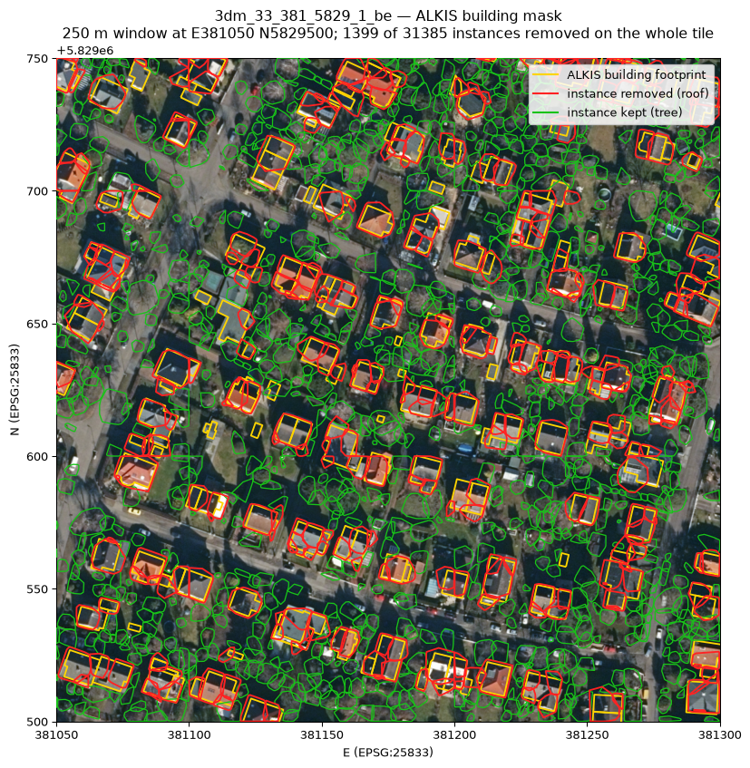

# Berlin ALS 2021 inference over the three km tiles around Revier 12 Tegelsee

Date: 2026-09-23 (run: 2026-09-22 20:49 - 2026-09-23 01:37 CEST)
Branch / commit: `fix/review-findings` @ `7199608 feat: ff3d_geo split/merge subcommands and the km-tile batch runbook`
Machine: carrot (H100 80GB, GPU 5 only), image `forestformer3d:cu118`, checkpoint
`work_dirs/clean_forestformer/epoch_3000_fix.pth`, host venv `/raid/cwinkelmann/ff3d-geo-venv`
Commands: `docs/benchmarks/RUNBOOK-tegel.md` section 8, run as one nohup'd script
`work_dirs/logs/berlin-run.sh`; log `work_dirs/logs/berlin-20260922-204933.log`
(copied to `~/work/hnee/ForestFormer3D_runs/berlin_out/logs/`).

This extends the single-tile Tegel/Spandau run (`2026-09-22-tegel-als.md`) from two
100 m tiles to three full 1 km x 1 km tiles: 73.5 M points and 105,829 predicted trees.

## 1. Input

| Tile | Points | Extent | Density | Sub-tiles run | Sub-tiles skipped | Points dropped |
|---|---|---|---|---|---|---|
| `3dm_33_380_5828_1_be` | 25,073,247 | E 380000-381000, N 5828000-5829000 | 25.1 pts/m2 | 100 | 0 | 0 |
| `3dm_33_381_5828_1_be` | 25,175,784 | E 381000-382000, N 5828000-5829000 | 25.2 pts/m2 | 100 | 0 | 0 |
| `3dm_33_381_5829_1_be` | 23,246,640 | E 381000-382000, N 5829000-5830000 | 23.2 pts/m2 | 100 | 0 | 0 |

All three are LAS 1.4 / point format 6, EPSG:25833. `python -m ff3d_geo split` cut each
into a full 10x10 grid of 100 m sub-tiles; none fell below the 1000-point `--min-points`
floor, so every sub-tile was inferred and every input point is accounted for in the
merged result (the merged point counts equal the source point counts exactly).

Density is 23-25 pts/m2, in the same range as the two 100 m tiles of the earlier run
(19 and 29 pts/m2) and still roughly two orders of magnitude below the TLS/ULS training
data (ForAINetV2).

## 2. Results per km tile

The blocks below are the merged `<tile>_report.md` files, built by
`ff3d_geo.report.build_report` over the merged LAS + merged tree GeoPackage. "Inference
runtime" is `n/a` because the merge step does not know the batch's wall time; the real
runtimes are in section 4.

### 3dm_33_380_5828_1_be

| Metric | Value |
|---|---|
| Points | 25073247 |
| Inference runtime | n/a |
| Trees (model) | 37386 |
| Trees (CHM local maxima baseline) | 39876 |
| Height min / median / max (model, m) | -14.3 / 21.9 / 42.9 |
| Height min / median / max (CHM, m) | 3.0 / 28.4 / 43.1 |
| Ground vs vegetation agreement | 97.6 % |
| Nodata fraction (semantic 255, excluded above) | 0.0 % |

| Model \ ALS | class 2 (ground) | other |
|---|---|---|
| semantic 0 (ground) | 8224655 | 494279 |
| semantic 1/2 (wood/leaf) | 112521 | 16241792 |

First pass usable: **no** (tree count 37386 vs CHM baseline 39876 (ok); median height 21.9 m vs CHM median 28.4 m (outside 3 m))

### 3dm_33_381_5828_1_be

| Metric | Value |
|---|---|
| Points | 25175784 |
| Inference runtime | n/a |
| Trees (model) | 37058 |
| Trees (CHM local maxima baseline) | 41616 |
| Height min / median / max (model, m) | 0.2 / 25.0 / 65.6 |
| Height min / median / max (CHM, m) | 3.0 / 29.4 / 42.0 |
| Ground vs vegetation agreement | 97.6 % |
| Nodata fraction (semantic 255, excluded above) | 0.0 % |

| Model \ ALS | class 2 (ground) | other |
|---|---|---|
| semantic 0 (ground) | 8146279 | 507253 |
| semantic 1/2 (wood/leaf) | 85712 | 16436540 |

First pass usable: **no** (tree count 37058 vs CHM baseline 41616 (ok); median height 25.0 m vs CHM median 29.4 m (outside 3 m))

### 3dm_33_381_5829_1_be

| Metric | Value |
|---|---|
| Points | 23246640 |
| Inference runtime | n/a |
| Trees (model) | 31385 |
| Trees (CHM local maxima baseline) | 34809 |
| Height min / median / max (model, m) | -11.4 / 17.6 / 54.8 |
| Height min / median / max (CHM, m) | 3.0 / 26.2 / 40.1 |
| Ground vs vegetation agreement | 96.2 % |
| Nodata fraction (semantic 255, excluded above) | 0.0 % |

| Model \ ALS | class 2 (ground) | other |
|---|---|---|
| semantic 0 (ground) | 7715789 | 619396 |
| semantic 1/2 (wood/leaf) | 264245 | 14647210 |

First pass usable: **no** (tree count 31385 vs CHM baseline 34809 (ok); median height 17.6 m vs CHM median 26.2 m (outside 3 m))

QGIS screenshots for the three merged tiles are **pending** (to be captured by hand per
runbook section 6, into `assets/2026-09-22-tegel-berlin-<tile>-qgis.png`).

## 3. Sub-tile border effects

Every tree belongs to exactly one 100 m sub-tile - ids are assigned per sub-tile and
`merge_las` only renumbers them - so the 100 m grid lines are hard cuts that no instance
crosses. Counted from the merged LAS (point extent per `treeID`) with a 1 m tolerance
against the tree's own sub-tile edges, and heights from the merged GeoPackage:

| Tile | Trees | Touching a border | Share | Expected if uniformly placed | Median height, border / interior (m) |
|---|---|---|---|---|---|
| `3dm_33_380_5828_1_be` | 37,386 | 5,846 | 15.6 % | 16.8 % | 25.4 / 21.0 |
| `3dm_33_381_5828_1_be` | 37,058 | 5,778 | 15.6 % | 16.8 % | 27.1 / 24.4 |
| `3dm_33_381_5829_1_be` | 31,385 | 5,150 | 16.4 % | 16.8 % | 20.8 / 16.9 |

The "expected" column is the share a uniformly scattered population of the same size
would show: a tree lands in the border band exactly when its centre is within
`1 m + its own half-extent` of an edge, and the median half-extent here is 3.4 m, giving
`1 - (100 - 2*4.4)^2 / 100^2 = 16.8 %`. The observed 15.6-16.4 % is at or slightly below
that, so **the tiling does not produce an excess of border instances** - the count is
what the geometry alone predicts.

Border trees are also consistently *taller* than interior ones (by 2.7-4.4 m median),
which is the opposite of what truncated crown fragments would look like. It is a size
bias rather than a quality signal: a bigger crown has a larger footprint, so it is more
likely to reach a border. Combined, the two observations say the 100 m tiling is not a
leading error source for this checkpoint - the height shift discussed below affects
interior trees just as much.

What the numbers cannot settle is duplication: a crown straddling a grid line is cut
into two instances in two different sub-tiles, and both survive the merge (the merge is
a concatenation with id renumbering, not a spatial de-duplication). With ~16 % of trees
at a border, a de-duplication pass over the merged GeoPackage is the obvious follow-up
if the tree table is ever used for counting rather than for a first look.

**Superseded (2026-09-24).** The seams were measured properly and then removed:
sub-tiles are now inferred with a 20 m halo and stitched with an overlap union-find
instead of merged, so every tree carries one id over the whole mosaic and no strip along
the grid lines is left under-segmented. On `3dm_33_381_5829_1_be` the unlabelled-point
excess in the 10 m strip fell from 6.30 pp to 0.011 pp, crowns crossing a line went from 0
to 3,277, and the split-pair excess over the natural floor fell 78 %; over the eleven tiles
the tree count went 300,452 → 311,380 with 2,574 trees straddling a km border under a
single id. Numbers, the floor correction, runtimes (1.99x) and the before/after viewer
screenshots: **`2026-09-24-seamless-ids.md`**. The results in this section are the *seamed*
v1 set, kept for comparison at `/Volumes/2TB/winmol/ALS_Data/berlin_als_2021_ff3d/` and
`berlin_potree/`; the new set is in `berlin_als_2021_ff3d_v2/` and `berlin_potree_v2/`.

## 4. Runtime

| Step | `3dm_33_380_5828_1_be` | `3dm_33_381_5828_1_be` | `3dm_33_381_5829_1_be` |
|---|---|---|---|
| `split` (100 sub-tiles) | 6 s | 6 s | 5 s |
| `run` (preprocess + inference + georef + trees + report) | 98.9 min (4 x 25 sub-tiles) | 96.4 min (1 x 100) | 91.6 min (1 x 100) |
| per sub-tile | 59 s | 58 s | 55 s |
| `merge` (CPU only) | ~3 min | ~2 min | ~2 min |

Total wall clock 20:49:33 - 01:37:07 = 4 h 47 min for 73.5 M points, plus about 7 min of
merging. Resources during the run: GPU 5 at 60-70 % utilisation and 2.8 GB of its 80 GB,
host RSS 1.4 GB for `tools/test.py`. Nothing came close to a memory limit, on either
side; the run is GPU-throughput bound, not memory bound.

The first km tile was deliberately run as four batches of 25 sub-tiles into one `--out`
so the first batch's wall time and host memory could be checked before committing to a
100-sub-tile batch. Chunking into one output directory is safe and cost nothing
measurable: each `run` rewrites only its own `<out>/scan_list.txt` and `empty_list.txt`,
and the host steps only touch the stems of that call, so the three extra preprocess
passes are the whole overhead (98.9 min for four chunks vs 96.4 min for one batch of the
same size). At ~58 s per sub-tile, a 1 km tile is about 1.6 h and a 100 sub-tile batch
is a perfectly comfortable unit.

All 300 sub-tiles succeeded; no tile needed the per-tile error isolation in the host
steps, and no sub-tile was skipped.

## 5. Reading the numbers

- **Tree count**: 37,386 / 37,058 / 31,385 against CHM baselines of 39,876 / 41,616 /
  34,809, i.e. 6.2 %, 11.0 % and 9.8 % *below* the baseline. All three pass the 50 %
  criterion comfortably and all three now undershoot, where the two 100 m tiles of the
  earlier run overshot slightly (+1.3 %, +10.8 %). At km scale the model is not
  exploding the instance count.
- **Height distribution**: the median is 6.5, 4.4 and 8.6 m below the CHM median on the
  three tiles - the same failure as on the 100 m tiles (3.3 and 4.0 m low) but larger.
  The obvious explanation is a tail of short spurious instances, and the reported minima
  (-14.3, 0.2 and -11.4 m against a CHM floor of 3.0 m) invite it. **Counted out, that
  explanation does not hold.** From the merged GeoPackages:

  | | `380_5828` | `381_5828` | `381_5829` |
  |---|---|---|---|
  | trees with height < 0 | 1 | 0 | 3 |
  | trees with height < 2 m | 60 (0.16 %) | 29 (0.08 %) | 382 (1.22 %) |
  | trees with height < 5 m | 2,472 (6.6 %) | 1,689 (4.6 %) | 4,144 (13.2 %) |
  | median after dropping every tree below 5 m | 23.2 (+1.3) | 25.7 (+0.7) | 20.4 (+2.8) |
  | shortest trees that would have to go to reach the +-3 m band | 21.2 % | 10.6 % | 26.7 % |
  | corr(height, `mean_score`) | 0.220 | 0.224 | 0.199 |
  | median `mean_score`, h<5 m vs h>=5 m | 0.590 / 0.625 | 0.577 / 0.625 | 0.571 / 0.632 |

  The negative heights are 1, 0 and 3 instances out of 31-37 thousand - individually real
  (a *negative* height means `top_z` fell below the 1 m ground grid at the stem, so the
  instance is a fragment of ground or low understory) but far too few to move a median.
  Discarding *everything* under 5 m - between 4.6 % and 13.2 % of all trees - closes only
  0.7 to 2.8 m of a 4.4 to 8.6 m gap. Closing it fully would mean culling the shortest
  11 % to 27 % of the population, which is no longer a tail.

  The gap is therefore **a shift of the whole height distribution, not a tail**. The open
  hypothesis - not settled by these numbers - is that the model systematically
  under-segments tall crowns: it splits a tall crown into parts, or terminates an
  instance below the true apex, so the typical predicted tree is a few metres shorter
  than the CHM maximum over the same crown. Two observations fit: the tree counts sit
  *below* the CHM baseline rather than above (so this is not simple over-segmentation
  into many small pieces), and the maxima overshoot on two tiles - 65.6 m and 54.8 m
  against CHM maxima of 42.0 and 40.1 m - which is one instance spanning a large vertical
  range, i.e. crowns being carved along the wrong surfaces rather than merely truncated.
  Confirming it needs the visual check below, or a per-crown comparison of predicted
  `top_z` against the CHM maximum inside the same crown polygon.
- **Ground vs vegetation**: 97.6 / 97.6 / 96.2 % agreement with the ALS classification,
  no nodata points at all, and the same asymmetry as before - the model over-calls
  ground (494k, 507k and 619k vegetation points labelled ground) about four times more
  often than it misses it (113k, 86k, 264k). The semantic head transfers to ALS intact;
  the failure is entirely in the instance head.
- **Per sub-tile**: of the 300 sub-tiles, 100 passed the per-tile decision rule and 200
  failed it (21/100, 34/100 and 45/100 usable, in the table's tile order). The failures
  are essentially always the median-height criterion: the count criterion failed once in
  300 (a single sub-tile of `3dm_33_381_5829`), the same split as at km scale. The worst
  per-sub-tile pass rate is `3dm_33_380_5828` at 21/100 and the best is
  `3dm_33_381_5829` at 45/100 - and `3dm_33_381_5829` is the *least* dense tile
  (23.2 pts/m2) as well as the one with the largest km-scale median gap (8.6 m) and the
  lowest ground agreement (96.2 %). Density therefore does not order the per-sub-tile
  pass rate, and no claim about a density driver is made here; what the per-sub-tile and
  km-scale rankings disagree about is presumably composition (a tile with more open or
  low-canopy sub-tiles can pass locally while its forested parts still drag the km-tile
  median down).
- **Pending visual check**: the QGIS screenshots are not captured yet, so the
  interpretation above rests on the numbers alone. What to look for, in order of what it
  would settle: whether tall crowns are split or truncated below their apex (the open
  hypothesis for the median gap), what the 55-65 m instances actually contain,
  ground-coloured points reaching up into low vegetation, and duplicate crowns on either
  side of a 100 m grid line.

## 6. Recommendation on ALS fine-tuning

Decision rule (`ff3d_geo.report.recommend`): usable as a first pass when the model tree
count is within 50 % of the CHM baseline count and the median model height is within 3 m
of the median CHM maxima height.

| Tile | Trees (model / CHM) | Median height (model / CHM, m) | First pass usable |
|---|---|---|---|
| `3dm_33_380_5828_1_be` | 37,386 / 39,876 | 21.9 / 28.4 | no |
| `3dm_33_381_5828_1_be` | 37,058 / 41,616 | 25.0 / 29.4 | no |
| `3dm_33_381_5829_1_be` | 31,385 / 34,809 | 17.6 / 26.2 | no |

**Recommendation: fine-tune on ALS.** All three km tiles fail, and they fail the same way
as the two 100 m tiles did, only more clearly: the tree-count criterion passes everywhere
(6-11 % under the CHM baseline, far inside the 50 % band) while the median-height
criterion fails everywhere by 4.4-8.6 m. Scaling from 100 m to 1 km did not change the
verdict, so the earlier result was not a small-sample artefact.

Three things follow for the next phase, in order of expected value per unit of work:

1. **Sweep `model.test_cfg.score_th` - cheap, worth trying, but do not expect it to close
   the gap.** It costs no training, it is a single `--cfg-options
   model.test_cfg.score_th=...` per run, and the tree counts sit *below* the CHM baseline,
   so there is headroom to discard instances and still pass the count criterion: even the
   full cull that would be needed to close the height gap - the shortest 21.2 % / 10.6 % /
   26.7 % - leaves 29.5 k / 33.1 k / 23.0 k trees against 50 % floors of 19.9 k / 20.8 k /
   17.4 k. What the measurements in section 5 say is that it is a **weak lever
   on the median**: removing all sub-5 m trees moves the median only 0.7-2.8 m against a
   4.4-8.6 m gap, and `score_th` cannot even do that cleanly, because score barely tracks
   height (r ~ 0.2; median score 0.58 for trees under 5 m vs 0.63 for the rest), so a
   threshold that removes the short instances removes a comparable share of tall ones.
   Run the sweep on one km tile, watch the median and the count together, and treat a
   1-3 m improvement as the realistic ceiling.
2. **Fine-tune the instance head on ALS-density data - this is the one that can close the
   gap.** The semantic head needs no attention (96-98 % ground agreement, 0 % nodata); the
   instance head does, and since the gap is a shift of the whole height distribution
   rather than a tail (section 5), no post-hoc filter reaches it. That needs a small
   ALS-labelled set - manually checked rows from these merged GeoPackages are a plausible
   starting point, since the predictions are already georeferenced - plus a `radius` /
   `voxel_size` sweep for the ~23-25 pts/m2 density this data has. Worth measuring first,
   because it is cheap and would sharpen the target: predicted `top_z` against the CHM
   maximum inside the same crown polygon, per tree, to confirm or kill the
   under-segmentation hypothesis.
3. **De-duplicate across sub-tile borders before using the tree table quantitatively.**
   ~16 % of trees touch a 100 m border and the merge does not de-duplicate, so a crown
   cut by a grid line is counted twice. Border effects are otherwise not a leading error
   source (section 3), so this matters for counting, not for segmentation quality.

Fine-tuning itself remains out of scope for this phase.

## 7. Buildings: ALKIS footprints masked out of the tree instances

The Berlin ALS 2021 point clouds have **no building class**. The classes present in these
tiles are 2 (ground), 3, 4, 5, 7 and 32; class 6 (building) is absent and roof points sit
in the vegetation bins 3/4/5. ForestFormer3D was trained on forest plots, so it reads a
roof as a crown and predicts tree instances on buildings - clearly visible in the
allotment area of `3dm_33_381_5829_1_be`. Nothing in the point cloud can tell it
otherwise, so the correction has to come from outside: Berlin's official ALKIS building
footprints.

`benchmark/fetch_berlin_buildings.py` downloads them from the Berlin GDI WFS
`https://gdi.berlin.de/services/wfs/alkis_gebaeude`, feature type
`alkis_gebaeude:gebaeude` (GeoJSON, EPSG:25833, the ALKIS `uuid` plus the
Gebaeudefunktion / Bauart / Bauweise attributes), into one GeoPackage at
`/Volumes/2TB/winmol/ALS_Data/berlin_buildings/alkis_buildings.gpkg`: layer `buildings`
(8 579 unique footprints over the 22 km tiles fetched, deduplicated by `uuid`) and layer
`tiles` (the coverage squares, so a re-run skips what is already there).

`python -m ff3d_geo buildings` masks them out of a finished km tile:

```bash
T=3dm_33_381_5829_1_be
D=/Volumes/2TB/winmol/ALS_Data/berlin_als_2021_ff3d/$T
.venv-cpu/bin/python -m ff3d_geo buildings --las $D/$T.las \
  --buildings /Volumes/2TB/winmol/ALS_Data/berlin_buildings/alkis_buildings.gpkg \
  --out $D/masked
```

A point inside a footprint - buffered by 1 m, because a roof edge overhangs its ground
plan - gets `semantic = 3` (building) and `treeID = -1` while keeping its ALS
classification; an instance with at least half its points inside footprints
(`--min-roof-fraction 0.5`) is dropped whole, and its remaining points lose their
`treeID` too. **Instance ids are not renumbered**, so the masked and unmasked tree tables
are comparable id for id. The whole product set (`<T>.las`, `<T>_trees.gpkg`,
`<T>_crowns.gpkg`, `<T>_instance_50cm.tif`, `<T>_semantic_50cm.tif`,
`<T>_report.json`/`.md`) is regenerated into `<T>/masked/`; the originals are left
untouched.

| | |
|---|---|
| Footprint source | Berlin GDI WFS `alkis_gebaeude`, feature type `alkis_gebaeude:gebaeude` (official ALKIS, not OSM) |
| Buffer | 1.0 m |
| `--min-roof-fraction` | 0.5 |
| Runtime | 39-656 s per km tile on the Mac (`.venv-cpu`), including the regenerated tree table, crowns, GeoTIFFs and report |

| Tile | Instances before | Removed | Partially masked | Points masked | Footprints in tile | Instances after |
|---|---|---|---|---|---|---|
| `3dm_33_379_5828_1_be` | 17 754 | 991 | 1 146 | 647 303 | 568 | 16 763 |
| `3dm_33_379_5829_1_be` | 16 144 | 737 | 660 | 555 946 | 421 | 15 407 |
| `3dm_33_380_5828_1_be` | 37 386 | 71 | 85 | 55 430 | 38 | 37 315 |
| `3dm_33_380_5829_1_be` | 16 503 | 2 103 | 2 074 | 1 453 583 | 1 270 | 14 400 |
| `3dm_33_381_5828_1_be` | 37 058 | 0 | 0 | 0 | 0 | 37 058 |
| `3dm_33_381_5829_1_be` | 31 385 | 1 399 | 1 398 | 933 162 | 840 | 29 986 |
| `3dm_33_381_5830_1_be` | 26 440 | 2 132 | 2 104 | 1 400 416 | 1 030 | 24 308 |
| `3dm_33_382_5828_1_be` | 27 538 | 579 | 602 | 418 629 | 247 | 26 959 |
| `3dm_33_382_5829_1_be` | 34 752 | 141 | 124 | 100 632 | 86 | 34 611 |
| `3dm_33_383_5828_1_be` | 18 470 | 2 517 | 927 | 1 779 819 | 738 | 15 953 |
| `3dm_33_383_5829_1_be` | 37 022 | 39 | 49 | 41 426 | 6 | 36 983 |
| **total** | **300 452** | **10 709** | **9 169** | **7 386 346** | **5 244** | **289 743** |

"Removed" is the number of instances dropped whole; "partially masked" instances kept
their id but lost the points that fall inside a footprint. Over the eleven Tegel tiles
the mask removes 10 709 of 300 452 instances (3.6 %) and relabels 7 386 346 points as
buildings.

The two extremes are the interesting ones. `3dm_33_381_5828_1_be` is entirely Tegeler
Forst: the WFS returns `numberMatched 0` for its bounding box, the mask changes nothing,
and the tile's numbers are untouched - a useful negative control that the mask does not
invent buildings. `3dm_33_383_5828_1_be` is the most built-up tile of the block and
loses 2 517 of 18 470 instances (13.6 %). The other three tiles above 1 000 removals
(`380_5829`, `381_5830`, `381_5829`) are the allotment and single-family-house belts
along the eastern edge of the forest; `381_5828`, `380_5828`, `382_5829` and `383_5829`
are forest or water and lose almost nothing.

The removals concentrate where the ALS data cannot help: a roof with 20-30 points per m2
and a flat-to-pitched surface is, to a model trained on forest plots, indistinguishable
from a crown. The per-tile tree counts in section 2 therefore overstate the tree count of
the built-up tiles by roughly the "Removed" column, and the masked products under
`<T>/masked/` are the ones to use for anything counting trees.



*250 m window at E381050 N5829500 on the DOP20 2021 orthophoto: ALKIS footprints in
yellow, the crown hulls of removed instances in red, kept instances in green. Nearly
every house carries one to three predicted "trees". Produced with
`benchmark/plot_berlin_buildings_overlay.py`.*

The masked products live next to the unmasked ones, in
`/Volumes/2TB/winmol/ALS_Data/berlin_als_2021_ff3d/<T>/masked/`. The table covers the
whole eleven-tile Tegel block (the same set as the visual report), not just the three km
tiles of section 2, because the mask is a per-tile post-processing step and the numbers
are only interesting across the whole block.

Four further km tiles that have since appeared on the volume - `379_5827`, `379_5830`,
`380_5827`, `381_5826` - and six of the eight Revier 13 tiles are **not** masked yet: the
2TB volume dropped below the 40 GB of free space the run refuses to go under. Their
footprints are already in `alkis_buildings.gpkg` (8 579 footprints over 22 km tiles), so
finishing them is one `python -m ff3d_geo buildings` call per tile once there is room -
about 1 GB per tile.

## 8. Reproducing

```bash
# carrot, host venv, GPU 5
cd /raid/cwinkelmann/ForestFormer3D && source /raid/cwinkelmann/ff3d-geo-venv/bin/activate
bash work_dirs/logs/berlin-run.sh       # see RUNBOOK-tegel.md section 8 for the loop
```

The border-effect and height-distribution numbers were computed on the Mac in `.venv-cpu`
from the merged `<tile>.las` and `<tile>_trees.gpkg` under
`~/work/hnee/ForestFormer3D_runs/berlin_out/berlin-2021/<tile>/` - one directory per km
tile, as in runbook section 8, because each `<out>` carries its own `scan_list.txt` and
mmengine log dirs that would otherwise overwrite each other.

Note on the run as executed: the `merge` step inside the loop failed on all three tiles
with laspy's "Incompatible point formats". The cause was a real bug in `ff3d_geo.merge`
(the merged header rebuilt the `treeID`/`semantic`/`score` extra dims from their names
and so dropped the descriptions `results_to_las` gives them, which laspy compares); it is
fixed in `11d850b`, with the test fixture corrected to carry the descriptions. The three
merges above were produced with that fixed code. On a checkout at `11d850b` or later the
runbook's loop runs end to end unchanged.

## 8. Revier 12 completion — fourteen more km tiles

Date: 2026-09-23 (run 15:50–19:00 CEST). Machine: carrot, six H100s shared with two other
blocks (the Revier 13 km tiles and a SegmentAnyTree queue), image `forestformer3d:cu118`,
checkpoint `work_dirs/clean_forestformer/epoch_3000_fix.pth`. Launched with the tracked
`benchmark/berlin_run_gpu.sh`, one queue per GPU, logs
`work_dirs/logs/berlin-r12b-gpu<N>-<ts>.log`.

This closes the Revier 12 / Tegelsee block: with the eleven tiles of sections 1–7 and the
earlier visual report, **E 379–383 km × N 5826–5830 km is now a complete 5 × 5 km
square** — 25 km tiles, all inferred with the same checkpoint. Counting the Revier 13
block to the west, 33 km tiles and 805,496 predicted trees are on disk.

Inputs: the eight tiles not yet held locally (`379_5830 380_5830 382_5826 382_5827
382_5830 383_5826 383_5827 383_5830`) were pulled from the INSPIRE ATOM feed with
`benchmark/fetch_berlin_als.py`; all eight were present in the feed (`8 downloaded,
0 not in any package, 0 failed`), so no tile of the fourteen had to be skipped. Matching
DOP 2021 (leaf-off) and TrueDOP 2025 summer (leaf-on) RGBI orthophotos were fetched for
all fourteen with `benchmark/fetch_berlin_dop.py` (14 written, 0 failed, per service).

### Per tile

"Sub-tiles run" is merged / produced by `ff3d_geo split`; the two tiles where these differ
lost one 100 m sub-tile each to the spconv failure described below. "Wall time" is the
`run` step's own wall time (`tile done (run Ns)`), measured under four to six concurrent
GPU queues, not on an idle box.

| Tile | Points | Sub-tiles run | Trees (model) | CHM baseline | Median height (m) | CHM median (m) | Ground/veg agreement | First pass usable | Wall time |
|---|---:|---:|---:|---:|---:|---:|---:|:--:|---:|
| `3dm_33_379_5826_1_be` | 12,502,375 | 96 / 97 | 15,280 | 20,032 | 12.0 | 15.9 | 91.1 % | no | 67 min |
| `3dm_33_379_5827_1_be` | 10,923,097 | 84 / 84 | 13,766 | 18,095 | 9.2 | 16.2 | 92.2 % | no | 48 min |
| `3dm_33_379_5830_1_be` | 13,030,051 | 96 / 96 | 12,980 | 16,400 | 7.9 | 10.1 | 88.2 % | yes | 37 min |
| `3dm_33_380_5826_1_be` | 19,727,639 | 100 / 100 | 30,381 | 35,691 | 20.8 | 24.4 | 96.3 % | no | 53 min |
| `3dm_33_380_5827_1_be` | 20,132,071 | 100 / 100 | 28,715 | 36,341 | 18.7 | 27.4 | 95.3 % | no | 51 min |
| `3dm_33_380_5830_1_be` | 15,132,813 | 100 / 100 | 18,809 | 23,041 | 6.8 | 10.1 | 89.7 % | no | 43 min |
| `3dm_33_381_5826_1_be` | 4,614,067 | 65 / 65 | 5,165 | 6,895 | 16.4 | 21.0 | 94.0 % | no | 17 min |
| `3dm_33_381_5827_1_be` | 16,625,079 | 85 / 85 | 23,351 | 29,300 | 22.1 | 27.0 | 96.4 % | no | 44 min |
| `3dm_33_382_5826_1_be` | 10,426,218 | 78 / 78 | 13,854 | 18,057 | 15.9 | 19.2 | 92.8 % | no | 33 min |
| `3dm_33_382_5827_1_be` | 3,596,432 | 81 / 82 | 2,394 | 3,337 | 15.6 | 19.4 | 95.7 % | no | 29 min |
| `3dm_33_382_5830_1_be` | 24,380,202 | 100 / 100 | 39,637 | 37,269 | 22.6 | 26.1 | 98.0 % | no | 60 min |
| `3dm_33_383_5826_1_be` | 14,548,444 | 100 / 100 | 16,768 | 24,493 | 9.0 | 12.8 | 89.6 % | no | 43 min |
| `3dm_33_383_5827_1_be` | 11,464,133 | 100 / 100 | 12,628 | 24,290 | 12.2 | 15.3 | 87.5 % | no | 39 min |
| `3dm_33_383_5830_1_be` | 26,764,131 | 100 / 100 | 37,458 | 39,737 | 23.5 | 28.5 | 98.1 % | no | 68 min |

Totals: **203.9 M points, 1,285 sub-tiles, 271,186 predicted trees** against a CHM
local-maxima baseline of 332,978, in **10.6 GPU-hours** — 29.7 s per 100 m sub-tile
averaged over the whole block. That is the vectorised path (commits `3da7f87`, `efb3fcf`)
under four- to six-way contention; the pre-vectorisation runs of section 4 needed 55–60 s
per sub-tile on an *uncontended* card.

GPU assignment (one queue per GPU, sequential within a queue):

| GPU | Tiles | Note |
|---|---|---|
| 0 | 379_5826, 379_5827, 380_5826 | overlapped one Revier 13 tile at launch (see below) |
| 2 | 380_5827, 381_5826, 381_5827 | |
| 4 | 383_5827, 383_5830 | |
| 5 | 382_5827, 382_5830, 383_5826 | |
| 6 | 379_5830, 380_5830, 382_5826 | |
| 3 / 2 | 379_5826, 382_5827 (recovery) | re-run after the spconv failure |

### What failed, and the fix

Two tiles died in the batch `run`: `3dm_33_379_5826_1_be` and `3dm_33_382_5827_1_be`, both
with spconv's

```
ValueError: Your points vanished here, ...
    Your Conv Params: spatial_shape=[17, 16, 16] ksize=[2,2,2] stride=[2,2,2] padding=[0,0,0]
```

raised inside `SpConvUNet` on one cylinder of one 100 m sub-tile whose points occupy too
small a voxel extent for the UNet's stride-2 downsampling. It is a property of the data,
not of the run: the same sub-tile fails again on a re-run. Because `ff3d_geo run` issues a
single `tools/test.py` for the whole km tile, one bad sub-tile kills the entire batch —
`379_5826` lost 62 of 97 sub-tiles that way, and the subsequent `merge` then failed with
no `*_100m.las` to merge.

Recovery: `work_dirs/logs/r12b-recover.sh <gpu> <tile>` (untracked, on carrot) re-runs a
tile in chunks of 20 sub-tiles into the same `--out`, so one bad sub-tile costs one chunk;
on a chunk failure it records the first sub-tile of that chunk without a result PLY in
`<out>/skip_list.txt` and carries on, then merges and writes the masks. Exactly one
sub-tile was skipped per tile:

| Tile | Skipped sub-tile | Cost |
|---|---|---|
| `3dm_33_379_5826_1_be` | `3dm_33_379_5826_E379300_N5826700_100m` | 96 of 97 sub-tiles merged |
| `3dm_33_382_5827_1_be` | `3dm_33_382_5827_E382700_N5827100_100m` | 81 of 82 sub-tiles merged |

So each of those two tiles has one 100 m hole (1 % of its area) in the merged LAS, tree
table, crowns and masks. Worth fixing at the source — chunking the batch inside
`ff3d_geo run`, or guarding the degenerate cylinder in `_predict_full_plot` — before the
next production block; it is the only failure mode seen in 25 Revier 12 km tiles.

One process-level slip: the queue on GPU 0 was launched while the Revier 13 block's own
GPU-0 queue was between tiles, so `nvidia-smi` showed the card idle although a queue still
owned it, and the two shared GPU 0 for one tile. Checking `nvidia-smi` is not enough —
check that no `berlin_run_gpu.sh <gpu>` (or other runner) still lists that GPU.

### Reading the numbers

The verdict of section 6 does not change: **13 of the 14 tiles fail the first-pass rule**,
and again only on the median-height criterion. The tree count stays inside the ±50 % band
everywhere (`382_5830` is the first tile in the whole block to come out *above* baseline,
+6 %); the median predicted height sits 2.2 to 8.7 m below the CHM median on every tile.

The one tile that passes, `3dm_33_379_5830_1_be`, does so because it is a low-canopy tile:
the CHM median there is only 10.1 m, so the usual shift of a few metres fits inside the
3 m band. `380_5830` (CHM median 10.1 m as well) misses it by 3.3 m. Neither is a sign
that the model does better on those tiles — it is the decision rule's absolute 3 m
threshold meeting a short canopy.

Ground/vegetation agreement spans 87.5–98.1 % and tracks canopy cover: the dense
closed-forest tiles (`382_5830`, `383_5830`, `381_5827`) sit at 96–98 %, the water- and
built-up-heavy ones (`383_5827`, `379_5830`, `383_5826`) at 87–90 %. The semantic head
keeps transferring to ALS; the instance head is still the part that needs ALS fine-tuning.

### Products

`/Volumes/2TB/winmol/ALS_Data/berlin_als_2021_ff3d/<tile>/` per km tile — `<T>.las`,
`<T>_trees.gpkg`, `<T>_crowns.gpkg`, `<T>_instance_50cm.tif`, `<T>_semantic_50cm.tif`,
`<T>_report.json`, `<T>_report.md`. Orthophotos:
`berlin_dop_2021/dop_2021_rgbi/<tile>.tif` and `berlin_dop_2025_sommer/<tile>.tif`.
Regenerated overview figures covering every tile with results:
`assets/berlin-visual/08-tiles-overview.png` and
`assets/berlin-dop/berlin-dop-mosaic-density.png` (33 tiles, 805,496 crowns). Both figure
scripts now discover the tile set from the result directories instead of a hard-coded
eleven-tile list.

```bash
# carrot: one queue per idle GPU, three tiles each
bash benchmark/berlin_run_gpu.sh 6 3dm_33_379_5830_1_be 3dm_33_380_5830_1_be 3dm_33_382_5826_1_be

# Mac: inputs and orthophotos
.venv-cpu/bin/python benchmark/fetch_berlin_als.py --tiles 382_5830 383_5830 \
    --out-dir /Volumes/2TB/winmol/ALS_Data/berlin_als_2021
.venv-cpu/bin/python benchmark/fetch_berlin_dop.py --rgbi --tiles 382_5830 383_5830 \
    --out-dir /Volumes/2TB/winmol/ALS_Data/berlin_dop_2021/dop_2021_rgbi

# Mac: figures
.venv-cpu/bin/python benchmark/plot_berlin_visuals.py --tile 3dm_33_381_5829_1_be \
    --data-dir /Volumes/2TB/winmol/ALS_Data/berlin_als_2021_ff3d \
    --data-dir ~/work/hnee/ForestFormer3D_runs/berlin_out/berlin-2021 \
    --out-dir docs/benchmarks/assets/berlin-visual --only 8
.venv-cpu/bin/python benchmark/plot_berlin_dop_overlays.py --only d
```
