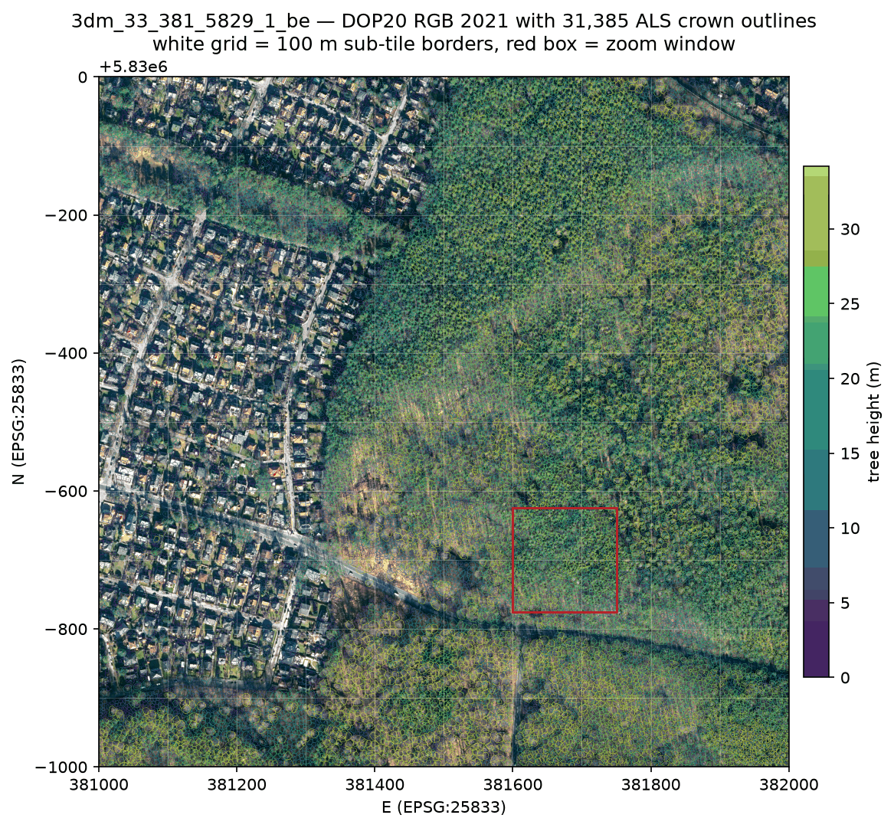
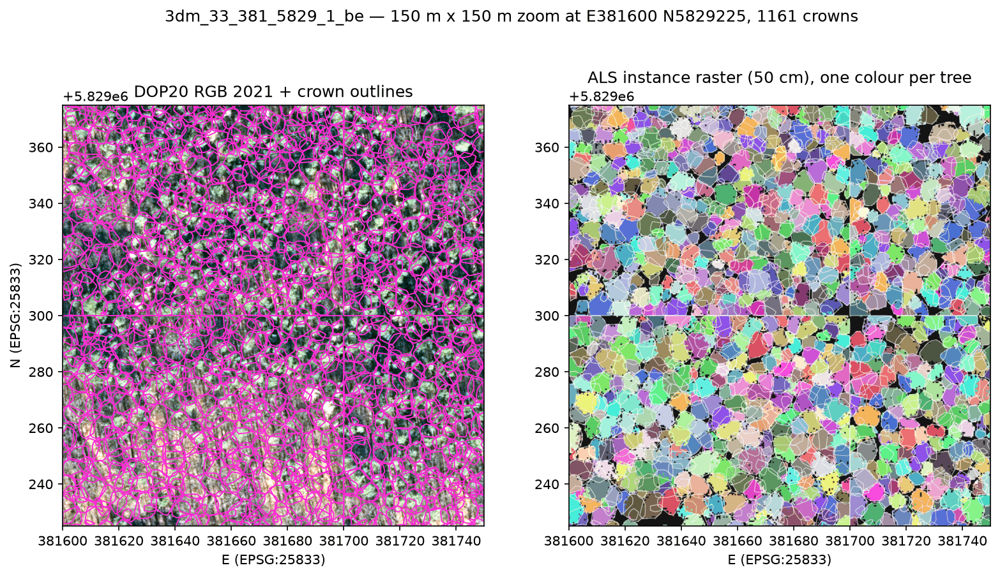
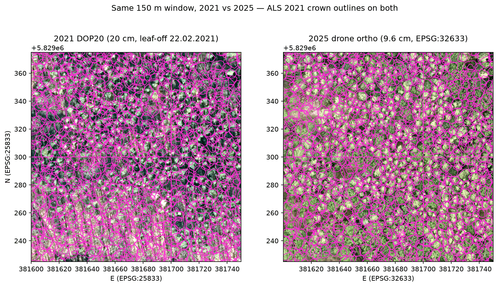
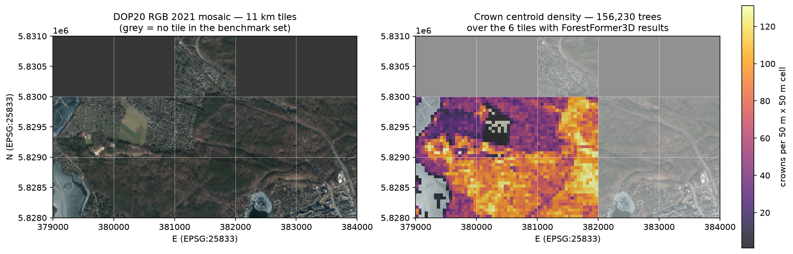

# Berlin DOP20 2021 orthophotos and ForestFormer3D crown overlays

2026-09-23

Reference imagery for the eleven 1 km Berlin ALS tiles that ForestFormer3D was run
on, so the predicted crowns can be eyeballed against something other than the point
cloud itself.

## Service discovery

The FIS-Broker endpoints named in older documentation
(`https://fbinter.stadt-berlin.de/fb/wms/senstadt/k_luftbild<year>_rgb`) are **gone** —
every candidate returned HTTP 404, including `.../senstadt/alkis`, so the whole
`fb/wms/senstadt/` prefix is retired, not just the orthophoto services. Berlin's
current view services live under `https://gdi.berlin.de/services/wms/<service>` and
are discoverable through the GeoNetwork catalogue
(`https://gdi.berlin.de/geonetwork/srv/ger/q?_content_type=json&fast=index&any=DOP`).

A **2021 service does exist** — no fallback year was needed:

| | |
|---|---|
| Service | `https://gdi.berlin.de/services/wms/dop_2021` |
| Service title | Digitale farbige Orthophotos 2021 (DOP20RGBI) |
| WMS version | 1.3.0 |
| Layers | `dop_2021_rgb` (DOP20RGB), `dop_2021_cir` (DOP20CIR), `blattschnitt` |
| CRS | `EPSG:25833` (+ CRS:84); EPSG:25833 axis order is E,N — 1.3.0 and 1.1.1 return byte-identical images for the same bbox |
| GetMap formats | `image/geotiff`, `image/tiff`, `image/gif`, `image/jpeg`, `image/png` |
| Max image size | not declared (no `MaxWidth`/`MaxHeight`/`LayerLimit` in the capabilities); 2500 x 2500 px requests were used anyway |
| Ground resolution | 0.20 m, positional accuracy ±0.4 m, delivered in a 2 km x 2 km Blattschnitt |
| Licence | dl-de/zero-2-0 (Geoportal Berlin) |
| Metadata record | `ef0c8276-78af-4444-969f-d01bb7d3c841` |

**Flight date: 22.02.2021** — the dataset's ISO 19139 lineage statement is literally
`Bildflug vom 22.02.2021`, so this is a leaf-off, late-winter flight. (Publication
date 2021-07-10.) That matters for the overlays: broadleaves are bare and the
canopy reads as grey-brown twig structure, while the pine stands stay dark green.

### RGBI

The product is 4-band RGBI, but a WMS only ever serves *rendered* 3-band images, so
there is no RGBI GetMap. `fetch_berlin_dop.py --rgbi` reconstructs one by fetching
both layers and stacking R,G,B from `dop_2021_rgb` with band 1 (= NIR) of the
`dop_2021_cir` rendering. That is a faithful NIR channel as far as the CIR rendering
is linear, which is good enough for vegetation indices at a glance but is *not* the
same as the original 4-band raster from the download service.

Neighbouring years, if a different date is ever wanted: `dop_2019`, `truedop_2020_sommer`,
`truedop_2022`, `truedop_2023`, `truedop_2024`, `dop_2025_fruehjahr`,
`truedop_2025_sommer`, `truedop_2026`.

## Fetching

`benchmark/fetch_berlin_dop.py` requests each 1 km tile as four 2500 x 2500 px
quadrants (`--px-per-tile 5000 --chunk 2500`, i.e. 20 cm), assembles them, and writes
one tiled LZW GeoTIFF per tile with the exact EPSG:25833 affine transform. It skips
tiles whose output already exists, retries with exponential backoff, and sleeps
between calls.

```bash
.venv-cpu/bin/python benchmark/fetch_berlin_dop.py --tiles all \
    --out-dir /Volumes/2TB/winmol/ALS_Data/berlin_dop_2021/dop_2021_rgb

.venv-cpu/bin/python benchmark/fetch_berlin_dop.py --tiles all --rgbi \
    --out-dir /Volumes/2TB/winmol/ALS_Data/berlin_dop_2021/dop_2021_rgbi
```

**Georeferencing check.** `3dm_33_381_5829_1_be.tif` has bounds
`(381000, 5829000, 382000, 5830000)` in EPSG:25833, byte-for-byte the same extent as
the ALS-derived instance raster
`berlin_out/berlin-2021/3dm_33_381_5829_1_be/..._instance_50cm.tif`. Side by side, the
allotment street grid in the west, the clearing in the middle and the diagonal path
across the south of the tile land on the same pixels in both. No offset was needed.

### Output

`/Volumes/2TB/winmol/ALS_Data/berlin_dop_2021/`

- `dop_2021_rgb/3dm_33_<E>_<N>_1_be.tif` — 3-band uint8, 5000 x 5000, ~55 MB each
- `dop_2021_rgbi/3dm_33_<E>_<N>_1_be.tif` — 4-band uint8 (R,G,B,NIR), ~73 MB each
- `report/` — a copy of this document and the figures

All eleven tiles fetched cleanly; no tile failed.

| tile | RGB (MB) | RGBI (MB) |
|---|---|---|
| 3dm_33_379_5828_1_be | 54.8 | 72.1 |
| 3dm_33_379_5829_1_be | 55.1 | 72.6 |
| 3dm_33_380_5828_1_be | 55.3 | 73.8 |
| 3dm_33_380_5829_1_be | 54.5 | 71.8 |
| 3dm_33_381_5828_1_be | 55.2 | 73.7 |
| 3dm_33_381_5829_1_be | 55.9 | 74.4 |
| 3dm_33_381_5830_1_be | 57.3 | 76.3 |
| 3dm_33_382_5828_1_be | 54.4 | 71.8 |
| 3dm_33_382_5829_1_be | 55.4 | 73.6 |
| 3dm_33_383_5828_1_be | 55.0 | 72.3 |
| 3dm_33_383_5829_1_be | 55.4 | 73.5 |

## Figures

Regenerate with `.venv-cpu/bin/python benchmark/plot_berlin_dop_overlays.py`
(`--only a b c d` to pick individual panels).

### a) Full tile with crowns coloured by height



All 31,385 ForestFormer3D crown polygons of `3dm_33_381_5829_1_be` on the DOP20 RGB,
outlines coloured by tree height. Look for: outlines stopping cleanly at the forest
edge against the allotment settlement in the west, the tall (yellow) outlines
following the mature stands along the eastern and southern margins, and the fact that
individual houses in the settlement still pick up crown-like instances — the model's
`wood`/`leaf` semantics do not exclude buildings here. The faint white grid marks the
100 m sub-tile borders the inference was run on; the red box is the zoom window of
the next two figures.

### b) 150 m zoom, DOP vs ALS instance raster



`E381600 N5829225`, 150 m x 150 m, 1,161 crowns. Left: crown outlines in magenta on
the DOP. Right: the same window of the 50 cm instance raster, one random colour per
tree, with the outlines repeated in white. Look for: each magenta ring sitting on one
bright canopy blob in the leaf-off imagery; the sub-tile seams at E381700 and
N5829300, where the tile-merge leaves a one-pixel gap and occasionally splits a crown
that straddles the border; and the black unassigned gaps between crowns, which are
understorey and ground rather than missed trees.

### c) Same window, 2021 DOP vs 2025 drone ortho



The 2021 crown outlines drawn on both the 2021 DOP20 (20 cm, leaf-off) and the 2025
drone orthomosaic (`/Volumes/2TB/winmol/training_data/WINDWURF_Tegel/Revier_12`, 9.6 cm, EPSG:32633 — the crowns are
reprojected, the image is not). Look for: how well four-year-old outlines still fit
the 2025 canopy in the closed pine matrix, versus the bare patches in the north-west
of the window where crowns have gone — windthrow and salvage between the two dates —
and the generally larger 2025 crowns where the stand simply grew into its outlines.

### d) Eleven-tile mosaic and crown density



Left: the eleven fetched DOP tiles laid out on their real EPSG:25833 grid (grey =
no tile at that grid cell in the benchmark set — only `381_5830` exists in the
northern row). Right: the same mosaic behind a 50 m crown-centroid density map built
from the `<tile>_trees.gpkg` files of the six tiles that have ForestFormer3D results
(156,230 trees). Look for: density tracking the forest exactly, dropping to zero over
the lake in the south-west, the sports field at `E380400 N5829400` and the road
corridors, and peaking above 120 crowns per 50 m cell in the dense young pine
regeneration — which is where the per-tree segmentation is hardest to verify by eye.

## Caveats

- The 2021 imagery is leaf-off (22.02.2021) while the ALS the crowns come from is a
  separate acquisition; small crown/canopy mismatches are as likely to be the date
  gap as segmentation error.
- The RGBI GeoTIFFs are a WMS reconstruction, not the original 4-band product. For
  anything quantitative use Berlin's download service instead.
- Figure (d) mixes tiles whose results live on `/Volumes/2TB/.../berlin_als_2021_ff3d`
  with tiles whose results only exist in `~/work/hnee/ForestFormer3D_runs/berlin_out`;
  the plotting script looks in both.
