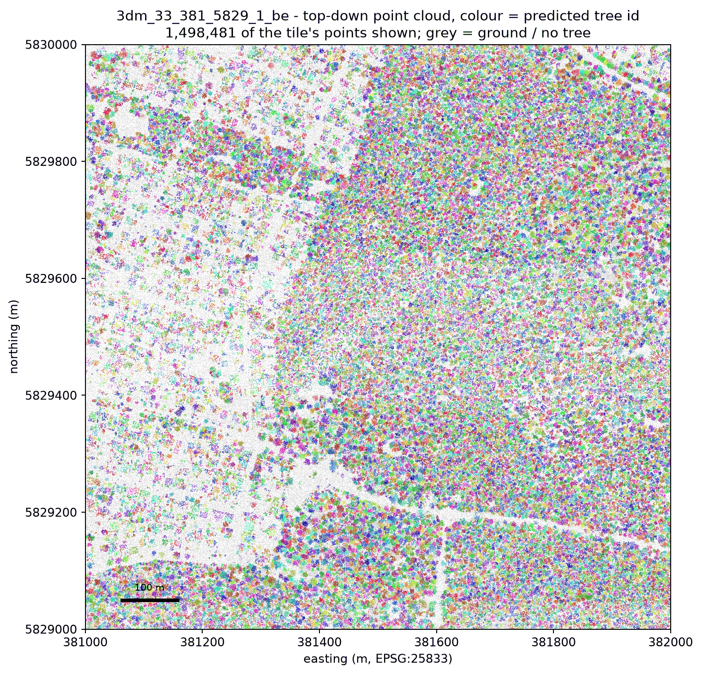
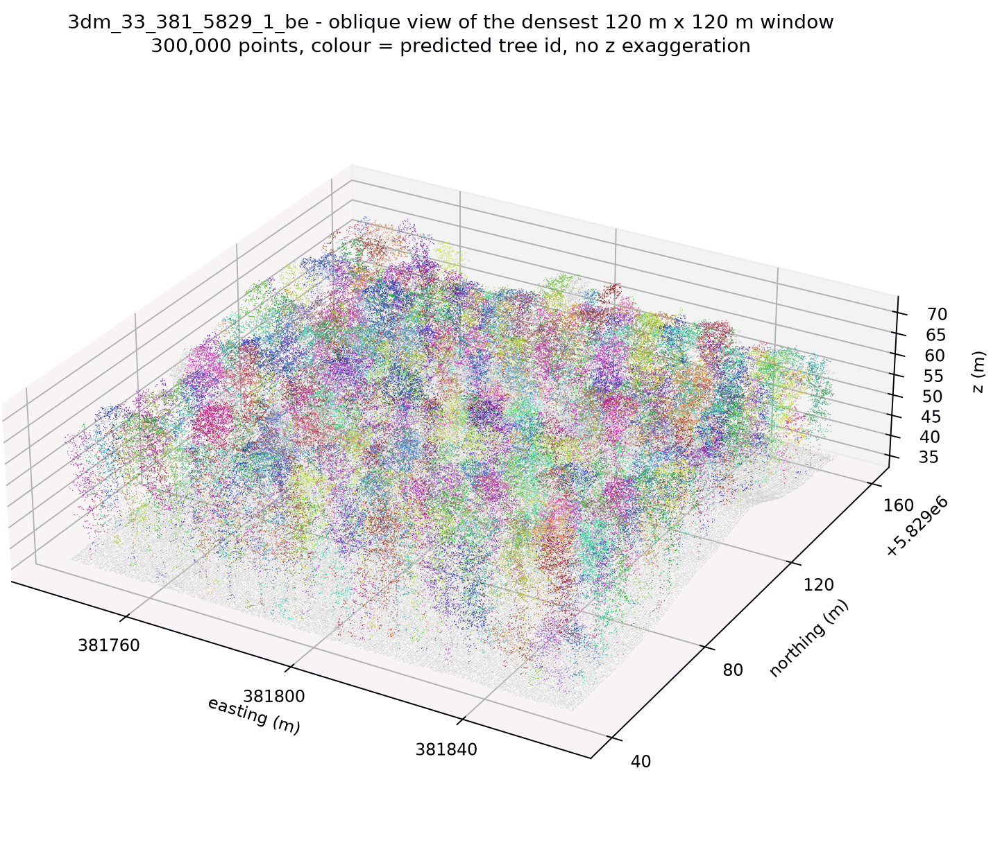
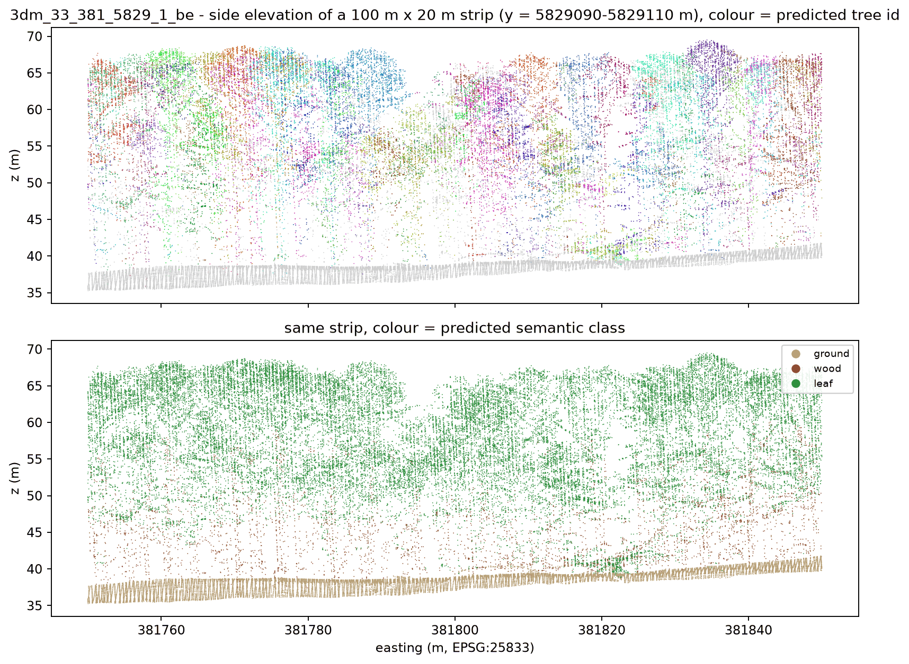
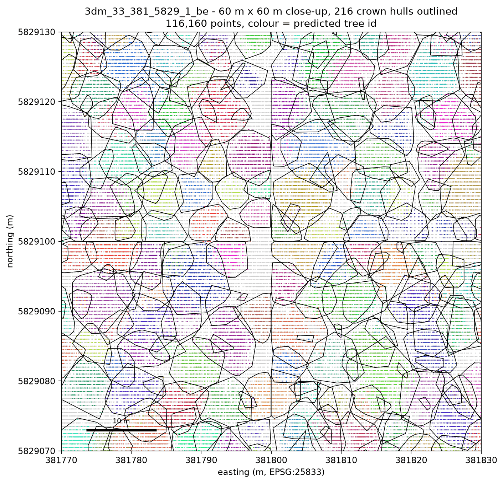
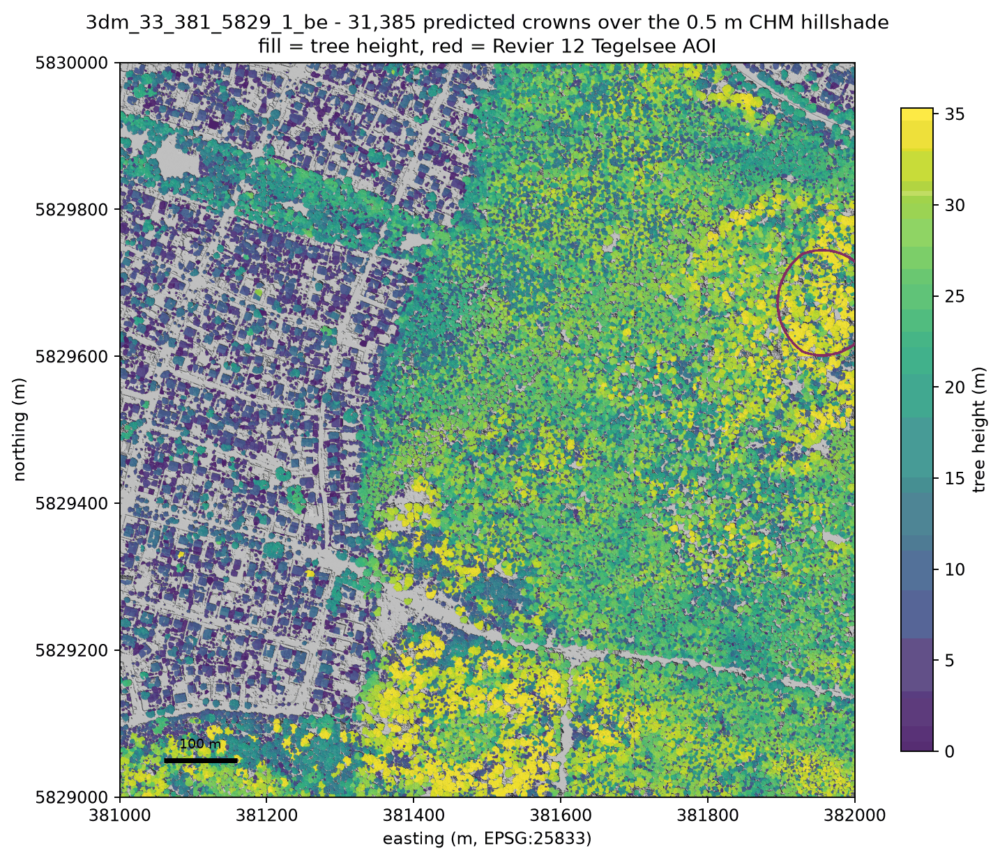
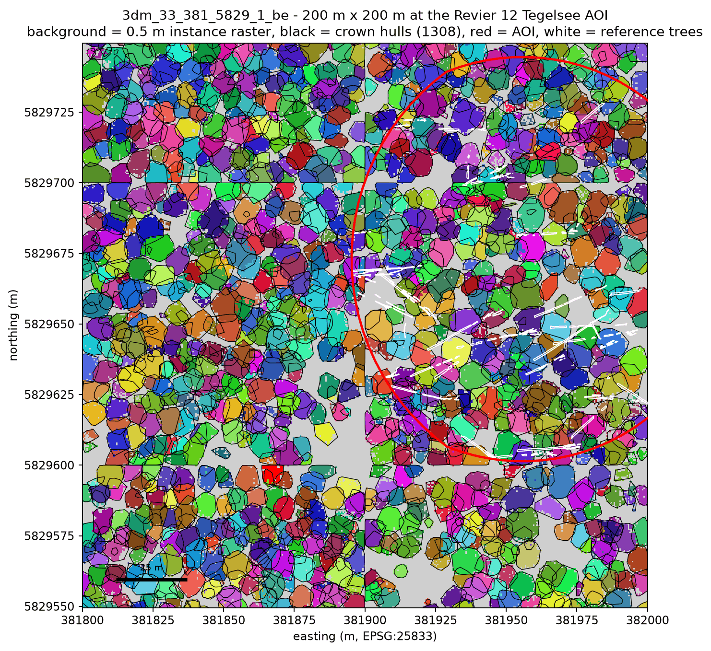
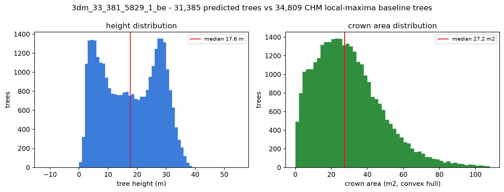
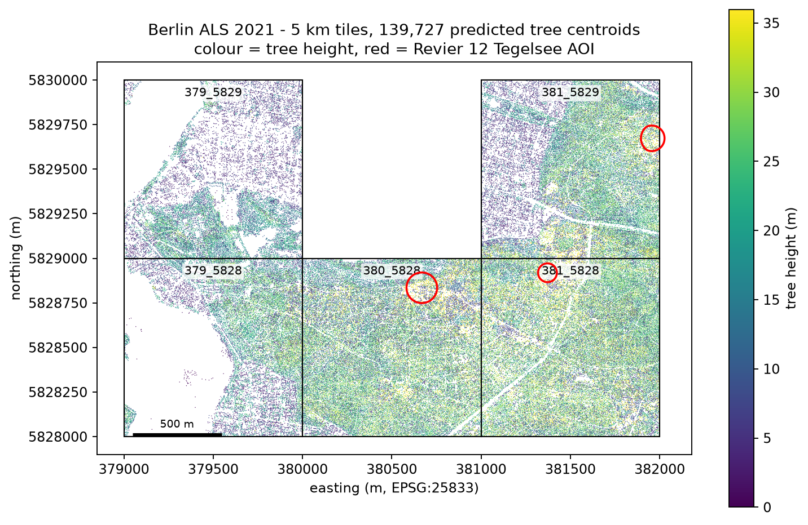

# Berlin ALS 2021 - visual report of the ForestFormer3D tree segmentation

Date: 2026-09-23
Branch: `fix/review-findings`
Figures: `docs/benchmarks/assets/berlin-visual/`, script `benchmark/plot_berlin_visuals.py`

## What is shown

These figures visualise the output of the ForestFormer3D checkpoint
`work_dirs/clean_forestformer/epoch_3000_fix.pth` (trained on ForAINetV2 TLS/ULS plots)
applied to Berlin ALS 2021 airborne LiDAR at 23-25 points/m2 - two orders of magnitude
sparser than the training data. Inference ran per 100 m sub-tile and the results were
merged back into full 1 km x 1 km tiles by `python -m ff3d_geo split` / `merge`
(run described in `2026-09-22-tegel-berlin-2021.md`). Every tile carries a `<tile>.las`
with the extra point dimensions `treeID`, `semantic` (0 ground / 1 wood / 2 leaf) and
`score`, a `<tile>_trees.gpkg` (one row per predicted tree), a `<tile>_crowns.gpkg`
(convex hull per tree), 0.5 m instance/semantic rasters and a `<tile>_report.json`.
Figures 1-7 are all from `3dm_33_381_5829_1_be` (23,246,640 points, 31,385 predicted
trees, E 381000-382000 / N 5829000-5830000); figure 8 covers the five km tiles that were
available when the figures were rendered. The red outline on the maps is the Revier 12
Tegelsee AOI from `202507_Rev_12_Tegelsee.gpkg`.

## Figures

### 1. Top-down point cloud of a full km tile



1,498,481 of the tile's 23.2 M points, coloured by predicted tree id (random categorical
colours, grey = ground / no tree). Notice that the segmentation degrades gracefully across
land cover: the closed forest in the eastern two thirds is a dense mosaic of distinct
instances, while the built-up west with its regular street grid yields isolated garden
and street trees on an otherwise grey, correctly tree-free surface - roads, roofs and the
water body stay uncoloured.

### 2. Oblique 3D view of the densest 120 m window



300,000 points of the 120 m x 120 m window with the most trees (E 381740-381860,
N 5829040-5829160; 740 trees), no z exaggeration. Notice that instances are separated in
3D and not merely in plan view - individual crowns rise as coloured columns from a grey
ground plane at ~37 m, and the canopy top is at ~68 m, i.e. crowns of about 30 m.

### 3. Side elevation of a 100 m x 20 m strip



Same window, x-z projection of the strip y = 5829090-5829110 m. Top panel: predicted tree
id. Notice the straight vertical seam at E 381800 - that is a 100 m sub-tile border, where
one crown is split into two instances; also notice that many trees are only represented by
their upper 15-20 m because ALS rarely penetrates to the stem base. Bottom panel: semantic
class. Ground (tan) forms a clean, closed surface that is correctly excluded from every
instance, leaf (green) dominates the canopy, and wood (brown, 1.31 M of 23.2 M points in
this tile) appears almost only as scattered returns below the crown - an ALS sensor barely
sees stems, so the wood class is much weaker here than in the TLS training data.

### 4. Close-up with crown polygons



60 m x 60 m (116,160 points, 216 crown hulls). Notice that single trees are individually
recognisable and that the convex hulls track them well, but the sub-tile grid is again
visible as straight cuts at E 381800 and N 5829100 where hulls stop abruptly, and that
several large crowns are covered by two or three overlapping hulls (over-segmentation of
broad crowns) while some adjacent small crowns share a single hull.

### 5. Crown map of the km tile over the CHM hillshade



All 31,385 crown hulls filled by tree height over a 0.5 m CHM hillshade computed from the
LAS (max z of ALS vegetation classes 3/4/5 minus nearest-neighbour-filled min z of ground
class 2). Notice the near-complete coverage of the canopy - grey areas are genuinely
tree-free (roads, buildings, the lake) - and the height gradient: mature stands of 30-40 m
in the forest to the east versus 5-15 m garden trees in the settlement to the west.

### 6. Zoom on the Revier 12 Tegelsee AOI



200 m x 200 m around the AOI (red) with the 0.5 m instance raster as background, 1,308
crown hulls in black and the reference tree polygons of the windthrow survey in white.
Notice the 100 m sub-tile borders at E 381900 and N 5829600/5829700 cutting straight
through the instance raster, and that the white reference polygons (individual, mostly
fallen stems) are elongated and much smaller than the crown hulls, so this AOI can only be
used for a positional check, not for a direct crown-to-crown IoU.

### 7. Height and crown-area distributions



Notice that the model's height distribution is broad and roughly bimodal (median 17.6 m),
with 382 trees below 2 m and only 3 with a negative height, whereas the CHM local-maxima
baseline for the same tile finds 34,809 trees with a median of 26.2 m: the model splits
part of the canopy into low sub-crowns, which is what drags its median 8.6 m below the CHM
median. Crown areas are tight around the median of 27.2 m2 (99th percentile 93.4 m2, 221
crowns above 100 m2).

### 8. Multi-tile overview



Crown centroids of all five available km tiles, coloured by height, with tile outlines and
the AOI. Notice that tree density and height follow land cover rather than tile borders -
the lake-side tiles 379_5828/379_5829 are sparse and low, the closed-forest tiles
380_5828/381_5828 are dense and tall - and that the per-tile tree count stays consistently
between 78 and 94 % of the CHM baseline.

## Per-tile summary

Numbers from each tile's `_trees.gpkg` and `_report.json`.

| Tile | Points | Trees (model) | CHM baseline | Median height (m) | Median crown area (m2) | Ground/veg agreement |
|---|---:|---:|---:|---:|---:|---:|
| 3dm_33_379_5828_1_be | 12,671,526 | 17,754 | 20,420 | 16.6 | 26.9 | 94.7 % |
| 3dm_33_379_5829_1_be | 15,085,213 | 16,144 | 20,648 | 10.8 | 25.9 | 88.9 % |
| 3dm_33_380_5828_1_be | 25,073,247 | 37,386 | 39,876 | 21.9 | 27.4 | 97.6 % |
| 3dm_33_381_5828_1_be | 25,175,784 | 37,058 | 41,616 | 25.0 | 27.7 | 97.6 % |
| 3dm_33_381_5829_1_be | 23,246,640 | 31,385 | 34,809 | 17.6 | 27.2 | 96.2 % |

"Ground/veg agreement" is the fraction of points where the predicted ground/non-ground
split matches the ALS `classification` (class 2 vs the rest).

## How to reproduce

```bash
# all eight figures for the default tile, into docs/benchmarks/assets/berlin-visual/
.venv-cpu/bin/python benchmark/plot_berlin_visuals.py

# another tile / another location of the products / a subset of the figures
.venv-cpu/bin/python benchmark/plot_berlin_visuals.py \
    --tile 3dm_33_381_5828_1_be \
    --data-dir /Volumes/2TB/winmol/ALS_Data/berlin_als_2021_ff3d \
    --out-dir /tmp/figs --only 5,6,8
```

`--data-dir` is repeatable and defaults to
`~/work/hnee/ForestFormer3D_runs/berlin_out/berlin-2021` plus
`/Volumes/2TB/winmol/ALS_Data/berlin_als_2021_ff3d`; figure 8 uses every tile directory
found under either that already has a `_trees.gpkg`, so it grows as more tiles are copied
over. The single LAS pass (tile subsample, window points, CHM) is cached as an `.npz`
under `$TMPDIR/ff3d_berlin_viz`; pass `--no-cache` to force a re-read. The script needs
only numpy, laspy, geopandas, rasterio, scipy, matplotlib and pillow (the
`.venv-cpu` environment) and always uses the `Agg` backend.
