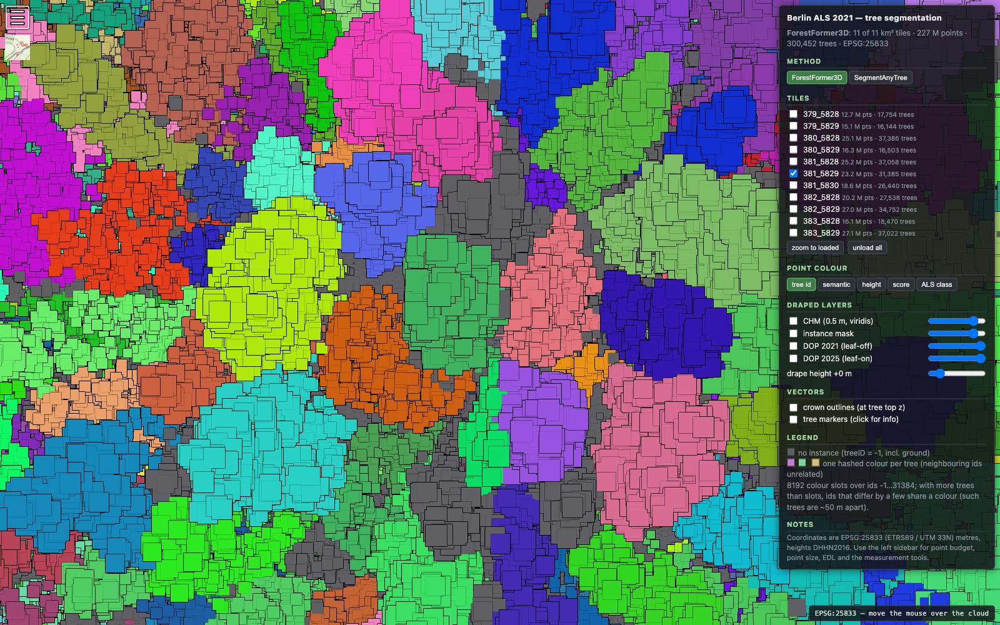
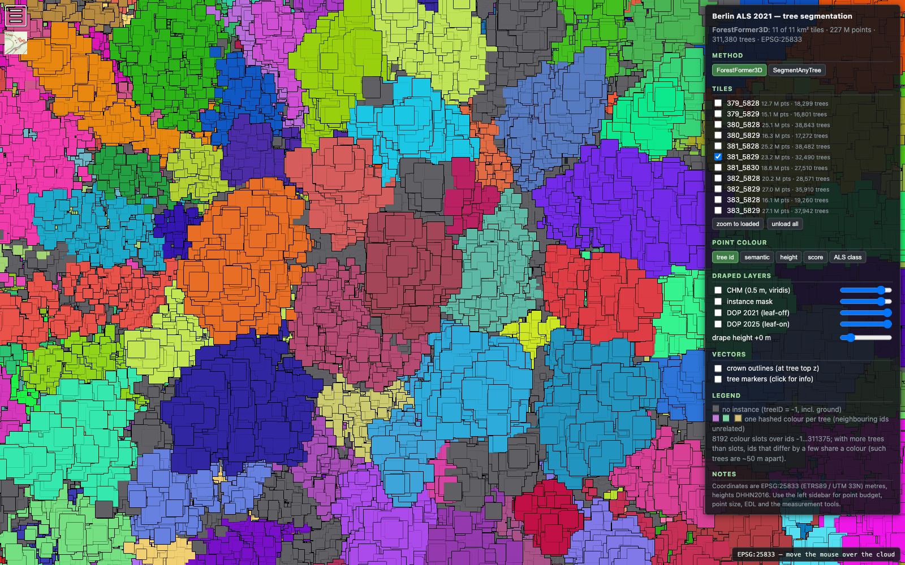
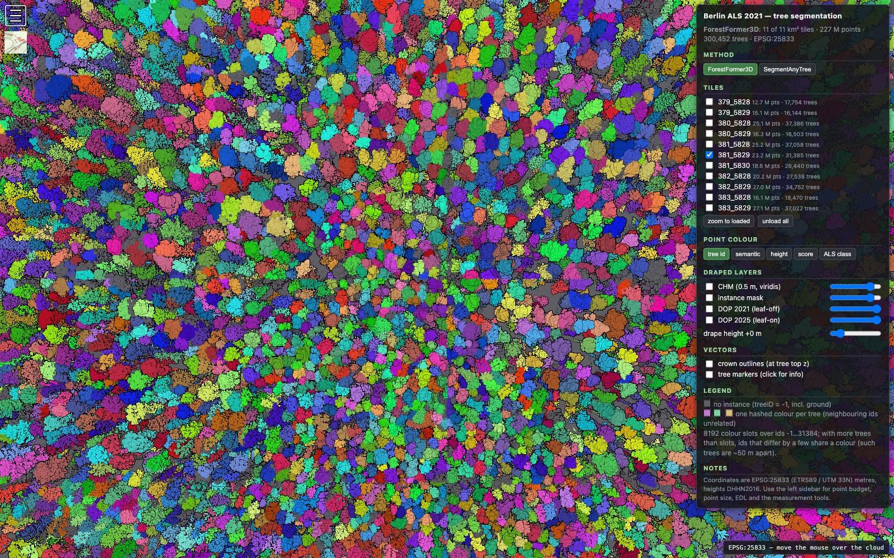
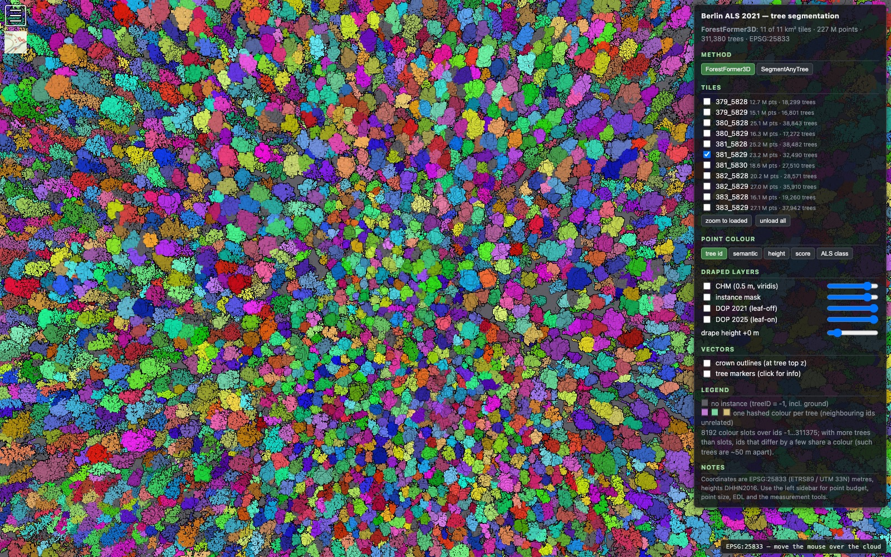

# Seamless tree ids across sub-tiles: validation on the Berlin mosaic

Date: 2026-09-24 (runs: 2026-09-23 23:07 – 2026-09-24 04:11 CEST)
Branch / commit: `fix/review-findings` @ `037af89` (carrot checkout)
Machine: carrot (8x H100 80GB; GPUs 2,3,4,5,6,7 — never GPU 1), image `forestformer3d:cu118`,
checkpoint `work_dirs/clean_forestformer/epoch_3000_fix.pth`, host venv
`/raid/cwinkelmann/ff3d-geo-venv`
Plan: `docs/superpowers/plans/2026-09-23-ff3d-05-seamless-ids.md` ·
Design: `docs/superpowers/specs/2026-09-23-seamless-tree-ids-design.md`

This is the end-to-end validation of Phase 5 (core-plus-halo inference plus overlap
stitching) on the eleven Berlin ALS 2021 km tiles around Revier 12 Tegelsee — the same
eleven tiles as `2026-09-22-tegel-berlin-2021.md` §8. The old, seamed results are kept
untouched on carrot (`work_dirs/seamed-v1/`, `inputs/berlin/sub-v1/`) and on the 2 TB
volume (`berlin_als_2021_ff3d/`, `berlin_potree/`).

## 1. What changed in the pipeline

`ff3d_geo split --buffer 20 --neighbours ...` writes each 100 m sub-tile with a 20 m halo
taken from the km tile **and its existing neighbours**, so a sub-tile on a km border is no
longer starved of context. `ff3d_geo stitch` then replaces `merge`: each point keeps the
label of the sub-tile whose **core** contains it, instances of adjacent sub-tiles are
unified by their IoU on shared halo points (union-find), and every component gets a dense
id over the whole mosaic — km-tile borders included.

`3dm_33_381_5829_1_be` split into 100 sub-tiles holding **45,132,229** points against
23,246,640 core points = **1.941x** (the predicted `140^2 / 100^2` = 1.96x).

Note against the plan text: `380_5830` and `382_5830` do exist in `inputs/berlin/`, so all
**eight** neighbours of `381_5829` fed its halo, not the seven the plan assumed
(`stitch.json` → `n_sources` 9 for the single-tile stitch).

## 2. Seam metrics on `3dm_33_381_5829_1_be`, before and after

Both measured with `ff3d_geo border-check` on the km-tile result LAS.

| metric | seamed (v1) | halo + stitch | plan target | |
|---|---:|---:|---|---|
| `strip_excess_pp` | 6.300 | **0.011** | < 1.0 | **pass** |
| `frac[0]` vs `interior_frac` | 0.3772 / 0.1237 | **0.1321 / 0.1235** | gap < 0.03 | **pass** (gap 0.0086) |
| `n_crossing` | 0 | **3,277** | > 0 | **pass** |
| `n_pairs` | 1,786 (spec: 1,843) | **923** | < 100 | pass, floor-corrected (§3) |
| `n_touching` / `touching_frac` | 5,150 / 16.41 % | **3,665 / 11.16 %** | 6–10 % | pass, floor-corrected (§3) |
| `n_trees` | 31,385 | **32,851** | ~29,500 ±5 % | pass, see §4 |

The spec's 1,843 pairs came from an earlier ad-hoc script; `border-check` itself reports
1,786 on the same seamed LAS, and that is the before-number used throughout this page.

The unlabelled-point profile by distance to the nearest 100 m line (0.5 m bins, 0–10 m)
is flat after the change instead of a 10 m gradient:

| bin (m) | 0.0 | 0.5 | 1.0 | 1.5 | 2.0 | 3.0 | 5.0 | 8.0 | 9.5 | interior |
|---|---|---|---|---|---|---|---|---|---|---|
| before | 0.377 | 0.321 | 0.274 | 0.236 | 0.209 | 0.175 | 0.152 | 0.134 | 0.129 | 0.124 |
| after | 0.132 | 0.132 | 0.131 | 0.130 | 0.127 | 0.123 | 0.122 | 0.119 | 0.117 | 0.124 |

About **330 k vegetation points per km tile** that the seamed run left with no instance
now belong to a tree.

## 3. Floor correction: these metrics are never zero

`n_pairs` and `touching_frac` do not go to zero for a seamless cloud: in a closed canopy
crowns end near *any* line and have a neighbour across it. The floor was measured directly
by running the same `ff3d_geo.border` functions on the same LAS with the 100 m lattice
**shifted 50 m in both axes**, so no line is a sub-tile seam. It was run at the time with
an ad-hoc `work_dirs/logs/border_control.py` on carrot; `border-check` has an `--offset`
since, so the control is now a tracked one-liner that reproduces these rows:

```bash
python -m ff3d_geo border-check --las work_dirs/berlin-mosaic/3dm_33_381_5829_1_be.las \
  --offset 50 --json work_dirs/berlin-mosaic/3dm_33_381_5829_1_be_border_control.json
```

| LAS | lines | `strip_excess_pp` | `touching_frac` | `n_crossing` | `n_pairs` |
|---|---|---:|---:|---:|---:|
| seamed v1 | seams | 6.300 | 0.1641 | 0 | 1,786 |
| seamed v1 | control (+50 m) | −1.456 | **0.0806** | 3,846 | **674** |
| halo + stitch | seams | 0.011 | 0.1116 | 3,277 | 923 |
| halo + stitch | control (+50 m) | 0.396 | **0.0788** | 3,887 | **679** |

The floor is `touching_frac` ≈ 0.079 — exactly the "about 8 %" the design predicted —
and `n_pairs` ≈ 675. Read as **excess over the floor**, which is the only seam-specific
part of either number:

| seam-specific excess | before | after | reduction |
|---|---:|---:|---:|
| unlabelled strip | +6.300 pp | +0.011 pp | **99.8 %** |
| crowns touching a line | +8.35 pp | +3.28 pp | **61 %** |
| split pairs | +1,112 | +244 | **78 %** |
| crowns crossing a line, as a share of the control rate | 0 / 3,846 = **0 %** | 3,277 / 3,887 = **84 %** | seams behave almost like ordinary lines |

So the plan's `n_pairs < 100` was unreachable by construction and its 6–10 % band *is* the
floor. The residual seam signal is real but small: about **244 crowns per km tile**
(0.7 % of the tree table) still end at a seam with a partner across it, against 1,112
before.

**Caveat: the control lattice is not quite the same measurement as the seam lattice, so
the four excess figures above are approximations rather than exact numbers.** The control
shifts the lattice *within one km LAS*, while the seam lattice includes the two km-border
lines per axis (`ff3d_geo/border.py` treats every multiple of `size_m` as a line, `x = E`
and `x = E + 1000` included). Across those two lines the partner crowns live in the
*neighbouring* LAS file, which `border_check` never reads, so on them no pair can form and
no crown can be seen to "cross", while every cross-km tree is "touching" by construction —
its extent in this file ends exactly at the file boundary. The control's lines at 50, 150,
…, 950 have neither property. Correcting for that:

- the seam lattice has ~9 pairing/crossing lines per axis against the control's 10, so the
  `n_pairs` floor is ~610 rather than ~675: the residual is **~315 pairs per km tile, not
  244**, and the reduction ~72 % rather than 78 %;
- the expected crossing count at the ordinary-line rate is ~3,500, so the measured 3,277
  is **~94 % of it, not 84 %** — the crossing result is *better* than the table claims;
- ~470 truncated cross-km trees per tile (2,600 tile-pair occurrences over 11 tiles) are
  counted as touching for free, about 1.4 pp of the 3.28 pp touching excess, so the
  seam-specific touching residual is nearer **1.9 pp** than 3.3 pp.

The per-tile ±0.5 pp `strip_excess_pp` spread in §5 is consistent with the same effect on
mosaic-edge tiles, whose outer km borders have no neighbour halo at all (~2 % of a tile's
area, at the old +25 pp). None of this changes the conclusion: the direction and the size
of the improvement stand, and two of the three corrections move the result the favourable
way. The number to use when the untuned `--iou 0.5` is revisited is the corrected residual
(~315 pairs per tile), not 244. A control free of the asymmetry would have to be measured
on a merged two-tile cloud, or with lines within a tolerance of the file's own bounding
box ignored; neither was done here.

## 4. Tree counts

`n_trees` rose from 31,385 to 32,851 on this tile instead of falling to ~29,500. The
projection in the plan subtracted the ~1,800 duplicate fragments but did not add the trees
the halo *recovers* from the previously unlabelled strip. Both effects are present:
31,385 − ~900 merged duplicates + ~2,400 newly segmented ≈ 32,851. The count moved
**towards** the independent CHM local-maxima baseline for this tile (34,809): 9.8 % below
it before, 5.6 % below it after.

## 5. The mosaic: one stitch over eleven km tiles

`benchmark/berlin_stitch.sh` with all eleven tiles, 04:03:20 → 04:11:12 (stitch itself
331 s; `border-check` + `masks` for eleven tiles another 141 s; no failures).

| `stitch.json` | value |
|---|---:|
| `n_trees` (mosaic) | **311,380** |
| `n_pairs_tested` (sub-tile adjacencies) | 4,004 |
| `n_unified` (instance unifications) | **249,286** |
| `n_cross_km` (unifications across a km line) | **20,983** |
| `n_cross_km_trees` (trees with points in >1 km tile) | **2,574** |
| `n_subtiles` / `n_sources` | 1,066 / 20 (11 stitched + 9 neighbour-only) |
| `size_m` / `buffer_m` | 100 / 20.0 |
| `iou_threshold` / `min_shared` | 0.5 / 20 |
| `runner_up_histogram` | {0: 349,723, 1: 8,602, 2: 14} |

**Trees before 300,452 → after 311,380 (+10,928, +3.6 %).** The "before" is the sum of the
eleven seamed tree tables in `2026-09-22-tegel-berlin-2021.md` §7.

Checks on the mosaic:

- The eleven per-tile tree tables concatenate to exactly `n_trees`: 18,299 + 16,801 +
  38,843 + 17,272 + 38,482 + 32,490 + 27,510 + 28,571 + 35,910 + 19,260 + 37,942 =
  **311,380**, all ids unique, the id set dense `0..311,379`. Each report's `n_trees` is
  its table's row count; its `n_trees_in_las` is larger because the LAS also carries the
  points of trees owned by a neighbouring tile (the eleven `n_trees_in_las` sum to
  313,965, i.e. 2,585 double counts for the 2,574 cross-km trees — a few sit in three or
  four tiles at a corner).
- A cross-km id is present in **both** km LAS files: 2,600 tile-pair occurrences. For
  example id **350** is in `3dm_33_379_5828_1_be.las` and `3dm_33_379_5829_1_be.las` (217
  ids shared by that pair) with its tree-table row in `379_5828`; id **232971** appears in
  four LAS files around the `380_5828` corner.

Per-tile seam metrics after the stitch (`<T>_border.json`):

| tile | `strip_excess_pp` | `frac[0]` / interior | `touching_frac` | `n_crossing` | `n_pairs` |
|---|---:|---|---:|---:|---:|
| `3dm_33_379_5828_1_be` | −0.299 | 0.1226 / 0.1215 | 0.1177 | 1,734 | 458 |
| `3dm_33_379_5829_1_be` | +0.336 | 0.1303 / 0.1375 | 0.1115 | 1,673 | 399 |
| `3dm_33_380_5828_1_be` | −0.497 | 0.1267 / 0.1312 | 0.1088 | 3,905 | 1,072 |
| `3dm_33_380_5829_1_be` | −0.330 | 0.1224 / 0.1273 | 0.1236 | 1,645 | 498 |
| `3dm_33_381_5828_1_be` | +0.005 | 0.1292 / 0.1342 | 0.1107 | 3,848 | 1,057 |
| `3dm_33_381_5829_1_be` | +0.011 | 0.1321 / 0.1235 | 0.1115 | 3,278 | 921 |
| `3dm_33_381_5830_1_be` | +0.300 | 0.1281 / 0.1200 | 0.1116 | 2,598 | 701 |
| `3dm_33_382_5828_1_be` | +0.049 | 0.1350 / 0.1307 | 0.1110 | 2,804 | 802 |
| `3dm_33_382_5829_1_be` | −0.124 | 0.1211 / 0.1234 | 0.1119 | 3,683 | 995 |
| `3dm_33_383_5828_1_be` | −0.326 | 0.1638 / 0.1593 | 0.1135 | 1,854 | 482 |
| `3dm_33_383_5829_1_be` | +0.061 | 0.1171 / 0.1140 | 0.1081 | 3,777 | 1,011 |

Every tile's strip excess is within ±0.5 pp of zero and every tile has thousands of crowns
crossing lines.

## 6. Runtime: what the halo costs

Measured back to back on `3dm_33_381_5829_1_be`, 100 sub-tiles each, same host, same
window. The no-halo run used a separate `split --prefix nohalo3815829` so the two runs did
not share sub-tile stems (see §8).

| | wall | per sub-tile |
|---|---:|---:|
| halo (`--buffer 20`, 8 neighbours), GPU 5 | **6,840 s** (1 h 54) | **68.4 s** |
| no halo, GPU 0, same window | **3,429 s** (57 min) | **34.3 s** |
| ratio | **1.99x** | 1.99x |

In the uncontended two-GPU window at the start of both runs the figures were 48.5 s and
23.3 s per sub-tile (**2.09x**). Either way the halo costs the ~2x the point ratio
predicts, and the stitch itself is host-only (331 s for the whole eleven-tile mosaic).

Whole mosaic, five to six GPUs in parallel: 1,066 sub-tiles, **67,353 s of GPU time**
(18 h 42), **3 h 57 wall**, 51.5–74.8 s per sub-tile per tile.

| tile | sub-tiles | run wall | s / sub-tile |
|---|---:|---:|---:|
| `3dm_33_379_5828_1_be` | 80 | 4,121 s | 51.5 |
| `3dm_33_379_5829_1_be` | 86 | 4,669 s | 54.3 |
| `3dm_33_380_5828_1_be` | 100 | 7,307 s | 73.1 |
| `3dm_33_380_5829_1_be` | 100 | 5,018 s | 50.2 |
| `3dm_33_381_5828_1_be` | 100 | 7,339 s | 73.4 |
| `3dm_33_381_5829_1_be` | 100 | 6,840 s | 68.4 |
| `3dm_33_381_5830_1_be` | 100 | 5,540 s | 55.4 |
| `3dm_33_382_5828_1_be` | 100 | 6,372 s | 63.7 |
| `3dm_33_382_5829_1_be` | 100 | 7,466 s | 74.7 |
| `3dm_33_383_5828_1_be` | 100 | 5,204 s | 52.0 |
| `3dm_33_383_5829_1_be` | 100 | 7,477 s | 74.8 |

## 7. Single-tile regression (no halo involved)

`python -m ff3d_geo run --las inputs/r12_tegel_E381300_N5828300_100m.las --out
work_dirs/tegel-r12-check --gpu 0`:

| metric | baseline (`2026-09-22-tegel-als.md`) | this run |
|---|---|---|
| `chm_baseline_count` | 397 | **397** (exact — the ALS classification survived the round trip) |
| `n_trees` | 402 | **405** (+0.75 %, run-to-run nondeterminism) |
| `n_points` | 192,814 | 192,814 |
| median height | 25.8 m | 25.9 m |
| runtime | — | 46.1 s |

The 100 m `run` path is untouched by this plan, as intended.

## 8. A hazard found on the way: concurrent runs must not share sub-tile stems

`ff3d_geo/cli.py` deletes the stale `<stem>_*.npy` exports in the **shared**
`data/ForAINetV2/forainetv2_instance_data/` before preprocessing, because
`batch_load_ForAINetV2_data.py` skips a scan whose `_vert.npy` already exists. Two `run`
invocations whose sub-tiles carry the same stems therefore overwrite each other's point
clouds mid-inference, silently, and both results are wrong. This bit the first attempt at
the timing comparison here (a no-halo baseline over `inputs/berlin/sub-v1/<T>/`, whose
stems are identical to the haloed ones); both runs were aborted and redone with a distinct
`split --prefix`. Production queues are safe because each km tile prefixes its sub-tiles
with its own name, but **never run the same km tile on two GPUs at once**. Noted in
`.claude/skills/ff3d-inference-km-tiles/SKILL.md` §2.

## 9. Viewer

New site `/Volumes/2TB/winmol/ALS_Data/berlin_potree_v2/` (octrees rebuilt with
PotreeConverter 2.1.1 from the stitched km LAS files via
`benchmark/potree_convert_tile.py`, overlays and manifest by
`benchmark/build_potree_site.py --ff3d-dir .../berlin_als_2021_ff3d_v2`). The old
`berlin_potree/` is unchanged and still serves the seamed result for comparison:

```bash
python3 benchmark/serve_potree.py --root /Volumes/2TB/winmol/ALS_Data/berlin_potree_v2 --port 8081
python3 benchmark/serve_potree.py --root /Volumes/2TB/winmol/ALS_Data/berlin_potree     --port 8080
```

Both screenshots are nadir views of `3dm_33_381_5829_1_be` in `tree id` mode with the same
camera, straddling the 100 m line at E 381700 (about 130 m across):





The wider pair (about 380 m across, same centre) shows that no 100 m colour banding
remains either — that was the viewer half of the problem, fixed separately in `afac64e`:





## 10. Where things are

| what | where |
|---|---|
| stitched products, per km tile | `/Volumes/2TB/winmol/ALS_Data/berlin_als_2021_ff3d_v2/<T>/` (`<T>.las`, `_trees.gpkg`, `_crowns.gpkg`, `_instance_50cm.tif`, `_semantic_50cm.tif`, `_report.json/.md`, `_border.json`) plus `stitch.json`, `stitch_ids.npy` |
| Potree v2 site | `/Volumes/2TB/winmol/ALS_Data/berlin_potree_v2/` |
| the same on carrot | `/raid/cwinkelmann/ForestFormer3D/work_dirs/berlin-mosaic/` |
| single-tile Step 1 stitch | `work_dirs/berlin-mosaic-step1/` (carrot) |
| seamed v1, kept | `work_dirs/seamed-v1/berlin-<T>/`, `inputs/berlin/sub-v1/<T>/` (carrot); `berlin_als_2021_ff3d/`, `berlin_potree/` (volume) |
| logs | `work_dirs/logs/berlin-halo-gpu{2,3,4,5,6,7}-*.log`, `berlin-stitch-mosaic-*.log`, `berlin-stitch-step1-*.log`, `nohalo-timing-*.log` |

## 11. Conclusion

The three artefacts the design set out to remove are gone or reduced to a small residue:
the under-segmented strip along the grid lines is at the interior level everywhere
(+0.011 pp on the validation tile, within ±0.5 pp on all eleven), crowns now cross the
lines at close to the rate they cross an arbitrary line (3,277 against the ~3,500 the
control implies once §3's lattice asymmetry is accounted for), and every tree carries one
id over the whole mosaic, km-tile borders included (2,574 trees straddle a km border and hold the
same id in both files). The price is 1.99x inference time; the stitch is minutes.

Open items: the residual ~315 split pairs per km tile (§3's corrected figure; IoU 0.5 /
`min_shared` 20 may be tunable), and 200 m cores (`split --size 200 --buffer 20`, 1.44x) which the same code path
supports but which has not been run.
