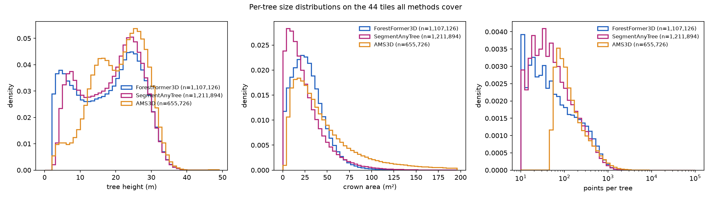

# Comparisons and analytics across the Berlin mosaic

Generated 2026-10-05 by `benchmark/berlin_analytics.py` from the stitched per-tile products on the 2TB volume; every number here is also in `assets/analytics/analytics.json`. The chapter compares the three segmentation methods with each other on identical points and, where an external reference exists, against the Berlin forest inventory and the tree cadastre. It says nothing about which method is *right* in the forest interior -- no per-tree ground truth exists there (data-sources chapter, section 5).

## 1. What was compared

| method | km tiles | trees | trees / km² | points / tree (median) | height p10 / p50 / p90 (m) | crown area p50 (m²) |
| :--- | ---: | ---: | ---: | ---: | ---: | ---: |
| ForestFormer3D | 33 | 832,130 | 25,216 | 283 | 4.3 / 18.2 / 29.4 | 26.4 |
| SegmentAnyTree | 33 | 861,795 | 26,115 | 221 | 6.9 / 20.5 / 29.5 | 20.2 |
| AMS3D | 3 | 80,564 | 26,855 | 281 | 12.0 / 24.1 / 32.3 | 34.7 |

All three methods ran on the same 20 m-halo split of each km tile and went through the same mosaic-wide stitch, so per-point labels are directly comparable (SegmentAnyTree and AMS3D preserve point order; ForestFormer3D's result is re-ordered to the split). AMS3D's 3 tiles are the subset it has been run on so far.

## 2. Trees per km tile

What we see: both methods agree on where the trees are -- the darkest cells are the closed forest in the west (R13) and north-east (the Tegel forest north of 5829), the palest are the lake tile 381_5827 (Tegeler See, 2-3 thousand trees) and the housing to the east. The ratio map is not noise: it is a block of red over the R13 forest tiles and a block of blue-to-white over R12 and the built-up tiles, i.e. the two methods differ systematically by forest, not tile by tile.

SegmentAnyTree finds 1.036x the ForestFormer3D tree count over the mosaic (per tile from 0.80 to 1.33). On the 16 tiles that are more than half forest by the stand map the ratio averages 1.06, on the other 17 tiles 1.01. The two surveyed forests differ: R12 0.96 (8 tiles with at least a quarter of the tile inside the footprint), R13 1.21 (8 tiles with at least a quarter of the tile inside the footprint). Where SegmentAnyTree reports more trees it has cut crowns into more pieces (section 4); where it reports fewer, ForestFormer3D's extra instances are mostly the small and flat ones of section 3.

## 3. Size distributions and quality flags

What we see: the height panel has two modes for both methods, a tall one at 24-28 m (the pine and oak canopy) and a short one at 4-7 m (understory, hedges, young trees in gardens), with a trough at 12-18 m; ForestFormer3D puts more mass under 8 m and SegmentAnyTree more at 20-30 m. The crown-area panel shows SegmentAnyTree's crowns shifted to smaller areas (mode 8-12 m² against 20-30 m²) -- the signature of cutting crowns into pieces. The points-per-tree panel has a spike at the smallest sizes for ForestFormer3D (instances of 10-20 points, the noise-sized class of the table below) and otherwise the same log-linear decline for both.

| method | trees | flat blobs (< 2 m, > 50 m²) | noise-sized (< 20 points) | taller than 40 m |
| :--- | ---: | ---: | ---: | ---: |
| ForestFormer3D | 832,130 | 1,716 (0.2 %) | 30,630 (3.7 %) | 305 (0.04 %) |
| SegmentAnyTree | 861,795 | 2 (0.0 %) | 32,822 (3.8 %) | 385 (0.04 %) |
| AMS3D | 80,564 | 0 (0.0 %) | 3,849 (4.8 %) | 55 (0.07 %) |

Both height distributions are bimodal: a canopy mode near 26 m and a second mode at 4-7 m (understory, hedges, young trees in gardens). ForestFormer3D has more of the low mode and of instances under 2 m; SegmentAnyTree's crowns are smaller (crown area p50 20 vs 26 m²) because it cuts more of them (section 4).

The flat-blob flag is the artefact seen in the viewer: an instance with almost no height but a large footprint is bare ground (ALS class 2) that the model labelled as leaf, not a tree. The noise-sized flag counts instances too small to be a crown at 20-30 pts/m². Both are candidates for a post-filter; neither is applied anywhere in this report.

On the 3 tiles all three methods cover (380_5828, 381_5828, 381_5829):

What we see: AMS3D has no short mode at all -- its height distribution starts at about 10 m -- and its crowns are the largest of the three. Mean shift with a height-dependent bandwidth merges the understory into the canopy tree above it, which is why it reports the fewest trees and the tallest ones; the two learned methods separate that layer.

| method | trees on these tiles | height p10 / p50 / p90 (m) | crown p50 (m²) |
| :--- | ---: | ---: | ---: |
| ForestFormer3D | 109,609 | 5.4 / 21.2 / 31.8 | 27.7 |
| SegmentAnyTree | 103,078 | 8.4 / 24.9 / 32.1 | 24.7 |
| AMS3D | 80,564 | 12.0 / 24.1 / 32.3 | 34.7 |

## 4. Instance agreement: ForestFormer3D vs SegmentAnyTree

![Instance agreement per km tile between ForestFormer3D (blue) and SegmentAnyTree (magenta), computed on identical points. Top: the fraction of each method's trees that have a counterpart in the other method overlapping with IoU ≥ 0.5 (bars), and the median IoU of those matched pairs (black line, right-hand reading on the same 0-1 axis). Bottom: the fraction of each method's trees whose points are covered by two or more instances of the other method -- a tree the other method has split. Tiles are ordered by easting, then northing.](assets/analytics/analytics_agreement.png)

What we see: the matched fractions move together from tile to tile (0.35-0.68) and are lowest on the built-up tiles (380_5830, 383_5826/5827), where both methods segment small garden vegetation differently, and highest on closed forest; the median IoU of a match is flat at 0.71-0.78 everywhere, so when the two agree on a tree they agree on its extent. The bottom panel is the asymmetry the whole chapter turns on: the blue bars (ForestFormer3D trees split by SegmentAnyTree) are 2-4x the magenta ones on every tile, 0.32-0.38 on the R13 forest tiles.

Pooled over 33 tiles and 584,133,672 identical points: 451,513 tree pairs overlap with IoU ≥ 0.5, i.e. 53.8 % of ForestFormer3D's 839,626 trees and 52.1 % of SegmentAnyTree's 867,266; the median IoU of a matched pair is 0.742 (the median of the per-tile medians; all pooled figures weight tiles by their tree count, so they differ in the last digit from the unweighted tile means quoted in the appendix). 26.8 % of ForestFormer3D trees are covered by two or more SegmentAnyTree instances against 11.0 % the other way round: where the two disagree, SegmentAnyTree has mostly cut one crown into several, which is also why it reports more trees.

## 5. Seams and the building mask

What we see, left: ForestFormer3D sits at 10-12 % on every tile, i.e. 2-4 points above the control floor, and SegmentAnyTree at 13-16 % with outliers to 20 % -- its smaller, more numerous instances touch lines more often, and some of its matches across sub-tiles fail the IoU threshold. Neither shows the 30-40 % that an un-haloed split produced. Right: the forest tiles lose nothing (no buildings), the lakeside and housing tiles 5-20 %, and 383_5827 -- the densest housing -- 40 % of its instances were roofs or roof vegetation.

| method | trees after stitch | instances unified over halos | cross-km matches | crowns touching a grid line (mean) | strip excess (mean pp) |
| :--- | ---: | ---: | ---: | ---: | ---: |
| ForestFormer3D | 832,130 | 672,321 | 62,203 | 11.1 % | 0.078 |
| SegmentAnyTree | 861,795 | 566,529 | 53,184 | 14.6 % | -0.074 |

The seam metrics are what `ff3d_geo border-check` measures on the stitched LAS: the share of crowns a 100 m grid line still cuts and the excess of unlabelled points in a 2 m strip along the lines relative to the interior (the control floor from an offset lattice is about 8 % and 0 pp).

The ALKIS footprints cover every tile; the mask removes 35,842 of 839,626 ForestFormer3D instances (4.27 %; per-tile counts, so a tree on a km border is counted in both tiles) and re-labels 23,436,930 points as building. The densest built-up tiles lose the most (383_5827 40.2 %, 383_5826 22.8 %, 380_5830 19.9 %).

## 6. Against the forest inventory (Forstbetriebskarte 2014)

![Predicted canopy height against the forest inventory, one marker per stand (only stands with at least 20 predicted trees and an inventory height). Horizontal axis: the height of the main canopy layer from the 2014 Forstbetriebskarte, a stand mean of dominant trees. Vertical axis: the 90th percentile of ForestFormer3D tree heights inside that stand. Marker size scales with the number of predicted trees in the stand, colour is the stand's dominant species (six most frequent by area; grey = other). The dashed line is equality.](assets/analytics/analytics_stand_heights.png)

What we see: the cloud follows the diagonal -- taller stands in the inventory are taller in the predictions -- and sits 4.4 m above it, consistently for pine, oak and larch; beech (green, the 30-36 m stands) lies on the line. The offset is expected: the ALS is seven growing seasons younger than the inventory, and a 90th percentile of tree tops exceeds a mean of dominant heights. The few stands far above the line at low inventory height (10-15 m) are young stands where tall remnant trees dominate the predicted percentile.

| dominant species | stands | ha | FF3D trees | trees / ha | inventory height (m) | pred. median (m) | pred. p90 (m) | crown p50 (m²) |
| :--- | ---: | ---: | ---: | ---: | ---: | ---: | ---: | ---: |
| Gemeine Kiefer | 201 | 1,000 | 336,763 | 337 | 25.8 | 22.8 | 29.9 | 26.6 |
| Traubeneiche | 92 | 348 | 128,637 | 370 | 25.7 | 21.8 | 29.3 | 28.0 |
| Rotbuche | 19 | 78 | 28,205 | 362 | 33.4 | 20.1 | 32.9 | 28.3 |
| Europäische Lärche | 36 | 56 | 22,189 | 393 | 24.4 | 23.1 | 29.4 | 26.8 |
| Gemeine Birke | 15 | 37 | 10,269 | 280 | 23.0 | 19.8 | 26.4 | 24.9 |
| Stieleiche | 7 | 35 | 12,391 | 351 | 25.7 | 17.1 | 27.8 | 27.7 |
| Eiche | 6 | 25 | 2,695 | 107 | 24.0 | 20.9 | 24.9 | 26.6 |
| Winterlinde | 6 | 16 | 6,278 | 403 | 23.9 | 22.1 | 27.7 | 26.4 |

Every ForestFormer3D tree was joined to the stand it stands in (458 stands with at least 20 trees). The inventory height is the main canopy layer's height from the 2014 management inventory, a stand mean of dominant trees, so the 90th percentile of the predicted tree heights is the comparable statistic (seven years of growth separate the two, worth a few metres of height). Over all stands the predicted p90 is 4.4 m above the inventory height on average (correlation 0.60); the predicted median sits below it, as it should for a figure that includes the understory.

## 7. Against the tree cadastre (street and park trees)

What we see: the stripes are the cadastre's integer heights, which stop at 30 m. Within each stripe the predicted heights spread widely, but their centre rises with the cadastre value and the residual histogram is symmetric about zero with a sharp peak (bias 0.09 m, MAE 4.3 m): most matched pairs agree to within a few metres. The dots far above the diagonal at cadastre heights of 4-8 m are young street trees whose nearest predicted top belongs to a taller neighbour's crown (the nearest-top rule assigns it anyway); the dots far below are large cadastre trees for which only a fragment was predicted. The two methods overlay almost exactly, so the scatter is the reference's and the matching rule's, not the model's.

| method | cadastre trees in the mosaic | with a predicted top ≤ 3 m away | street | park | height pairs | bias (m) | MAE (m) | r |
| :--- | ---: | ---: | ---: | ---: | ---: | ---: | ---: | ---: |
| ForestFormer3D | 20,294 | 81.9 % | 82.4 % | 81.5 % | 14,857 | 0.09 | 4.25 | 0.51 |
| SegmentAnyTree | 20,294 | 86.4 % | 87.4 % | 85.7 % | 15,675 | 0.10 | 4.08 | 0.54 |

The cadastre lists managed trees with a surveyed position and a height that is updated at inspection, so a predicted tree top within 3 m of a cadastre position is counted as a detection (the nearest one only; a cadastre tree hidden under a larger neighbour's crown is a miss by construction). The height comparison uses the detected pairs with a cadastre height. Detection by genus, ForestFormer3D (eight most frequent):

| genus | cadastre trees | detected |
| :--- | ---: | ---: |
| Ahorn | 4,704 | 82.8 % |
| Linde | 2,679 | 82.2 % |
| Eiche | 2,477 | 84.1 % |
| Kiefer | 1,615 | 82.1 % |
| Robinie | 1,178 | 84.9 % |
| Hainbuche | 669 | 73.2 % |
| Birke | 568 | 84.7 % |
| Douglasie | 516 | 84.7 % |

## 8. The WINMOL survey footprints

| footprint | ha | method | footprint covered by the method's tiles | trees inside | trees / covered ha | height p10 / p50 / p90 (m) |
| :--- | ---: | ---: | ---: | ---: | ---: | ---: |
| R12 | 515 | ForestFormer3D | 100 % | 193,620 | 376 | 6.1 / 22.5 / 31.5 |
| R12 | 515 | SegmentAnyTree | 100 % | 186,147 | 361 | 9.1 / 24.9 / 31.8 |
| R12 | 515 | AMS3D | 43 % | 67,545 | 301 | 12.9 / 24.8 / 32.5 |
| R13 | 1,034 | ForestFormer3D | 56 % | 204,882 | 353 | 6.7 / 22.1 / 29.0 |
| R13 | 1,034 | SegmentAnyTree | 56 % | 234,652 | 405 | 7.9 / 22.5 / 28.9 |
| R13 | 1,034 | AMS3D | 0 % | 0 | – | – / – / – |

Density is per covered hectare, so partially covered footprints (R13 Spandau until its eleven remaining tiles are processed; AMS3D on its tile subset) stay comparable; the tree counts are partial.

## 9. Caveats

* Agreement between methods is not accuracy: two methods can agree on a wrong split.
* The inventory heights are stand means from 2014 and the cadastre heights are inspection estimates; both references are coarser than the ALS-derived heights they are compared with.
* The flat-blob and noise flags are descriptive; no filtering was applied to any count in this report.
* AMS3D covers a subset of tiles; its rows are not comparable with the 33-tile totals of the other two.
