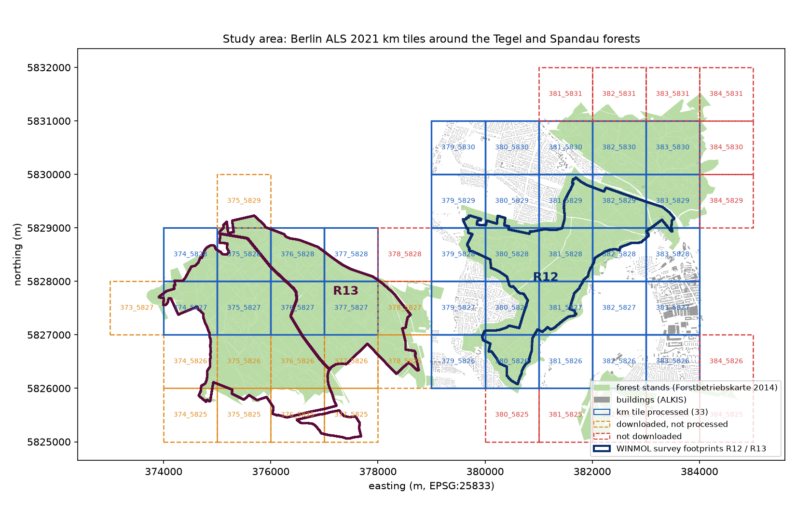
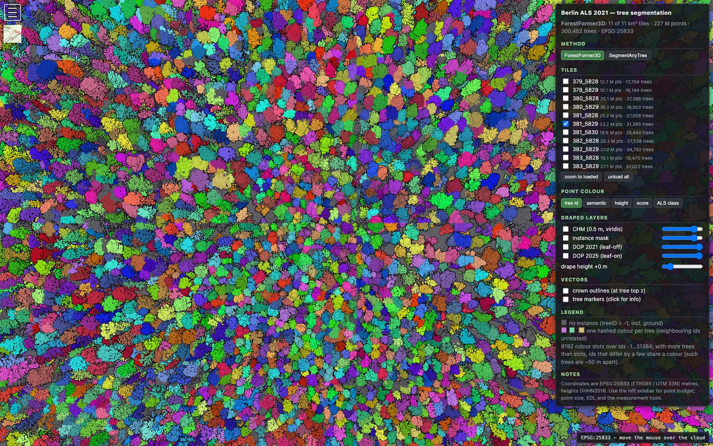
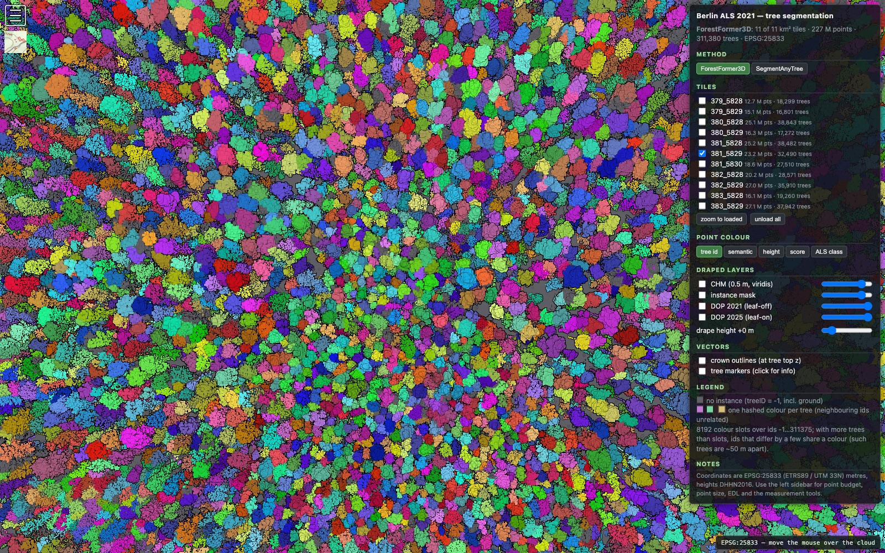
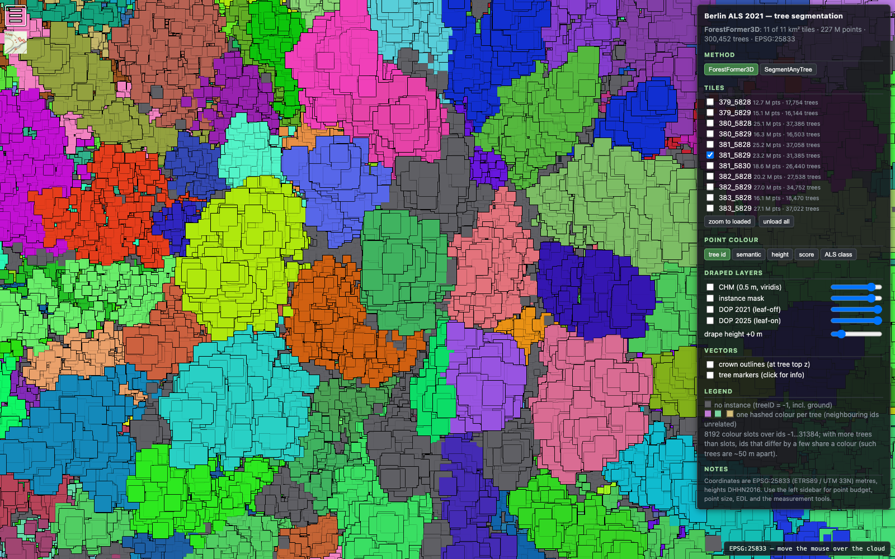
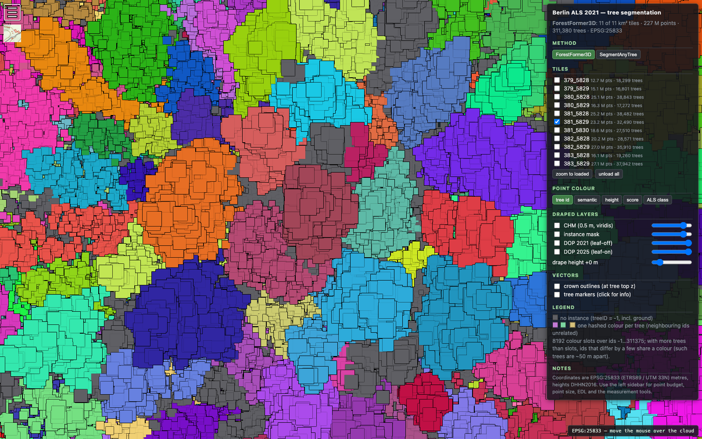
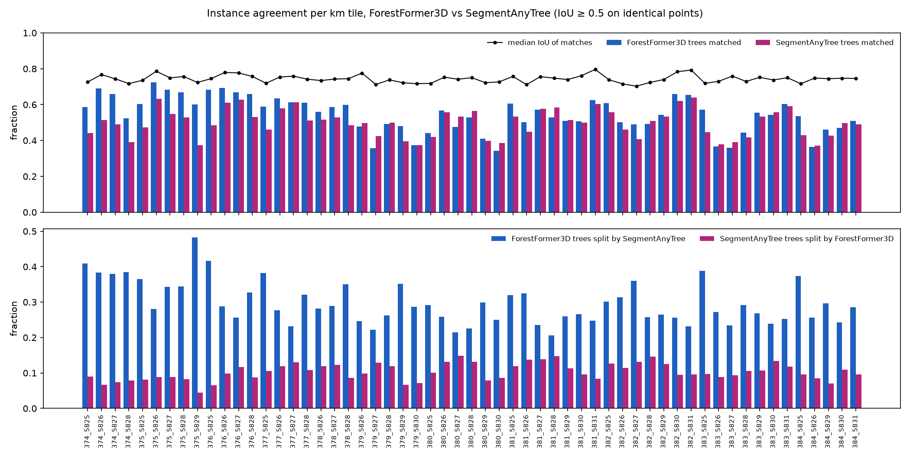
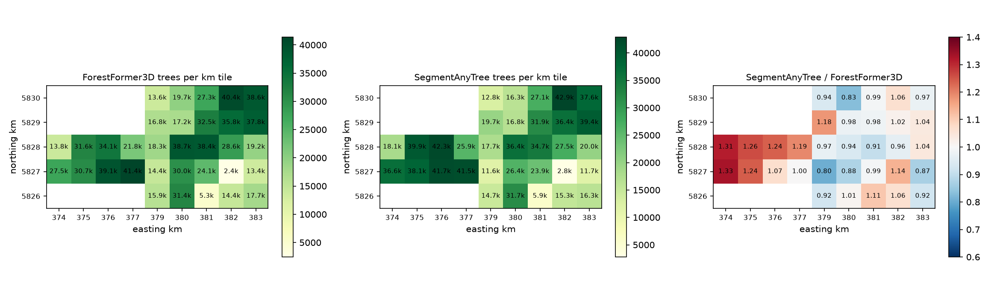

# ForestFormer3D — city-scale tree segmentation on open ALS data

This is a fork of the official [ForestFormer3D](https://bxiang233.github.io/FF3D/) (ICCV 2025
oral) implementation. The upstream code trains and evaluates on dense forest-plot scans; this
fork adds the tooling to run it **unchanged, without retraining, on real georeferenced
airborne laser scanning (ALS) tiles** and ran it over 44 km² of Berlin's open 2021 ALS
covering the Tegel and Spandau forests.

> The original project README — paper, citation, dataset, and the upstream setup, training and
> testing instructions — is kept in full at the [bottom of this file](#original-project-readme).

**Result: one seamless mosaic of 1,107,126 tree instances** over ~580 million points, each with
a position, top height, crown polygon, point count and confidence score, delivered as LAS point
clouds, GeoPackage tree tables, GeoTIFF rasters, a QGIS project and a web viewer. Two other
methods were run on exactly the same points through exactly the same tiling and merging:
[SegmentAnyTree](https://github.com/SmartForest-no/SegmentAnyTree) (the other published deep
model) and AMS3D (a classical adaptive mean-shift baseline); a fourth, PointTreeFormer
(S. Reder, HNEE), enters as results only on 15 of the tiles.

📄 **Full report: [`docs/benchmarks/report/berlin-ff3d-report.pdf`](docs/benchmarks/report/berlin-ff3d-report.pdf)**
([markdown](docs/benchmarks/report/berlin-ff3d-report.md)) · pipeline:
[`docs/inference-pipeline.md`](docs/inference-pipeline.md) · runbook:
[`docs/benchmarks/RUNBOOK-tegel.md`](docs/benchmarks/RUNBOOK-tegel.md)



*The study area in EPSG:25833. Green: forest stands of the Berlin Forstbetriebskarte 2014; grey:
ALKIS building footprints; squares: the 1 km ALS tiles; thick outlines: the WINMOL 2025 survey
footprints of Revier 12 Tegelsee (east) and Revier 13 Spandau (west).*

---

## What we found

### 1. The method scales from 100 m plots to a city, if the tiling is right

The model is trained on ~100 m plots, so each 1 km tile is split into 100 m sub-tiles. Done
naïvely, every sub-tile border becomes a scar: an unlabelled strip plus crowns cut in half with
two different ids. Splitting with a **20 m halo** and then merging *all* sub-tiles of the whole
mosaic **in one pass** — unifying instances by their IoU on the shared halo points — gives tree
ids that are unique and dense across sub-tile *and* km-tile borders alike. The excess of
unlabelled points along the grid lines dropped from **6.3 to 0.115 percentage points**, and
911,528 instances were unified over the halos.

| before: seamed, one run per sub-tile | after: 20 m halo + mosaic-wide stitch |
| --- | --- |
|  |  |
|  |  |

Cost: about **1.5 GPU-hours per km tile** on an H100 (SegmentAnyTree 1.9, AMS3D 22 CPU-minutes
on 48 cores). See [`docs/benchmarks/2026-09-24-seamless-ids.md`](docs/benchmarks/2026-09-24-seamless-ids.md).

### 2. The two deep models largely agree — and disagree in one characteristic way

Compared on **778,681,715 identical points**: 637,325 tree pairs overlap at IoU ≥ 0.5 (57.0 % of
ForestFormer3D's trees, 52.2 % of SegmentAnyTree's), and those matches are tight (median IoU
**0.742**). Where the two differ, SegmentAnyTree has usually **cut one crown into several**:
28.8 % of ForestFormer3D trees are covered by two or more SegmentAnyTree instances, against
10.5 % the other way round.



*Per km tile: the fraction of each method's trees with an IoU ≥ 0.5 counterpart (bars) and the
median IoU of those pairs (black line); below, the fraction of each method's trees that the
other method has split into two or more instances.*

SegmentAnyTree reports **1.095x** as many trees overall, but the surplus is not noise — it is a
block: ratio **1.20** in the Spandau forest (R13) against **0.97** in Tegel (R12). That the two
forests behave differently is itself a finding; their stand structure differs.



### 3. Three methods, three different ideas of what a tree is

| method | km tiles | trees | trees / km² | points / tree (median) | height p10 / p50 / p90 (m) | crown area p50 (m²) |
| :--- | ---: | ---: | ---: | ---: | ---: | ---: |
| ForestFormer3D | 44 | 1,107,126 | 25,162 | 285 | 4.9 / 18.6 / 28.8 | 26.2 |
| SegmentAnyTree | 44 | 1,211,894 | 27,543 | 212 | 6.9 / 19.8 / 28.8 | 19.4 |
| AMS3D (mean shift) | 44 | 655,726 | 14,903 | 302 | 10.8 / 21.6 / 29.9 | 36.6 |


*Normalised histograms (area 1) over the whole mosaic, one curve per method: height above
ground, crown area (convex hull), points per instance.*

Both learned methods produce a **bimodal** height distribution — a canopy mode near 26 m and a
second mode at 4-7 m (understory, hedges, young garden trees). The classical mean-shift baseline
has **no short mode at all**: its heights start around 10 m, it reports the fewest and largest
instances, because a height-dependent bandwidth merges the understory into the canopy tree above
it. Separating that layer is what the learned models add. SegmentAnyTree's smaller crowns (p50
19.4 vs 26.2 m²) are the signature of the splitting seen above.

### 4. Where an external reference exists, the predictions hold up

* **Street and park trees.** Of 21,023 Berlin tree-cadastre trees inside the mosaic, **82 %**
  have a ForestFormer3D tree top within 3 m (86 % for SegmentAnyTree), with no height bias
  (0.15 m) and a mean absolute height difference of 4.2 m — the order of the cadastre's own
  whole-metre inspection estimates.
* **Forest inventory.** Per stand, the 90th percentile of predicted heights tracks the 2014
  Forstbetriebskarte's canopy height by species (r = 0.62 over 554 stands), sitting 4.3 m above
  it — roughly seven growing seasons, which is exactly the gap between the two datasets.
  Predicted densities are 280-400 trees/ha under a pine-dominated canopy.


### 5. Two domain artefacts need a post-filter

The Berlin ALS has **no building class** (class 6 is absent; roof points sit in the vegetation
bins 3/4/5), so the model happily segments roofs and roof vegetation as trees. Masking the
official ALKIS footprints removes **3.5 %** of instances mosaic-wide, up to 40 % on the densest
tile. The second artefact is flat, wide blobs — bare ground labelled as vegetation — which a
minimum-height rule removes (the stitch's 2.0 m rule dropped 15,841 instances). Both are
built into the pipeline (`ff3d_geo buildings`, the stitch height rule / `ff3d_geo filter`).
Checked on tile 379_5826: 88.7 % of the points inside the 1,803 footprints there are class 5
("high vegetation"), and the raw model marks 57.6 % of them as tree instances; the mask drops
2,036 of 15,269 instances on that tile. The viewer carries both states, "ForestFormer3D" (masked,
footprint points shown as semantic class 3, red) and "ForestFormer3D raw", so the effect of the
mask can be inspected point by point. What neither rule catches: jetties and moored boats
over water (no footprint, and the ground grid under water is interpolated from the shore, so
they pass the height rule). The analogous fix is now built in but not yet applied to the
mosaics: `ff3d_geo run --mask-polygons` keeps points inside ALKIS buildings, water and
structure polygons (jetties, canopies, carports) away from the model before inference, so
nothing has to be repaired afterwards.

### What this does *not* establish

**Which method is right inside the forest.** No per-tree ground truth exists there, so every
method-to-method number above is *agreement*, not accuracy. The 974 hand-delineated WINMOL field
circles in Revier 12 and 13 are the one species-labelled reference on these tiles and are the
obvious next step; both survey footprints are now fully inside the mosaic.

Further caveats are collected in
[`docs/benchmarks/2026-10-05-discussion.md`](docs/benchmarks/2026-10-05-discussion.md): the model
runs far from its training domain (the ForAINetV2 plots are 5-100x denser than this ALS — see the
[density study](docs/benchmarks/2026-09-23-als-density-eval.md)), the references are coarse and
dated, the mosaic edge has a one-sided halo, and inference is not bit-deterministic (run-to-run
variation is below every difference reported here, but not zero).

---

## What this fork adds to the upstream code

* **`ff3d_geo/`** — a pure-Python (no torch/CUDA) package that runs the model on georeferenced
  LAS/LAZ tiles: `convert` → GPU inference in the container → `georef` back to LAS 1.4, plus
  tree GeoPackage, crown polygons, GeoTIFF masks and a markdown/JSON report. Subcommands
  `split` / `stitch` / `border-check` implement the halo tiling and the mosaic-wide merge;
  `buildings` applies the ALKIS mask; `filter` the minimum instance height; `masks`
  rasterises; `ams3d` is the baseline.
* **`benchmark/`** — the reproducible pipeline: data fetch (`fetch_berlin_als.py`,
  `fetch_berlin_dop.py`, `fetch_berlin_buildings.py`, `fetch_berlin_forest_stands.py`,
  `fetch_berlin_trees.py`), the per-GPU queue and mosaic stitch (`berlin_run_gpu.sh`,
  `berlin_stitch.sh`), the comparison methods (`sat_run_gpu.sh`, `ams3d_run_cpu.sh`), the
  analytics (`berlin_analytics.py`), the QGIS project, the Potree viewer and this report.
* **A CUDA 11.8 image** (`Dockerfile`, `forestformer3d:cu118`) for A100/L40/H100 hosts, with the
  legacy 11.6 one kept as `Dockerfile.a100-cu116`.
* **Robustness and speed fixes** in the inference path: degenerate cylinder regions are skipped
  instead of aborting a whole km-tile batch, binary PLY output, the vectorised z-filter (the
  former per-mask loop was 81 % of prediction time), cylinders batched through the sparse
  backbone (`model.test_cfg.region_batch`, default 8: inference step 73 s -> 54 s per 100 m
  sub-tile on an idle H100, results unchanged within the run-to-run noise), and a configurable
  `model.test_cfg.region_step_factor` that trades cylinder overlap for a 3.7x speed-up (the
  default stays at the paper's 0.25; see
  [`docs/benchmarks/2026-09-23-inference-profile.md`](docs/benchmarks/2026-09-23-inference-profile.md)).
* **Tests**: CPU tests in `tests/`, GPU tests in `tests/gpu/`, and `docker/smoke.sh`.
  Deliberately-unfixed oddities are listed in [`docs/known-issues.md`](docs/known-issues.md).

---
## Running it yourself

### Environment (CUDA 11.8 image)

`Dockerfile` builds `forestformer3d:cu118`: PyTorch 2.0.1 / CUDA 11.8 with MinkowskiEngine,
spconv, torch-scatter, torch-cluster, torch-points-kernels and the segmentator extension
compiled for compute 8.0, 8.6, 8.9 and 9.0 (A100, A10/A40, L4/L40, H100). The previous
CUDA 11.6 image is kept as `Dockerfile.a100-cu116` for reference; the manual steps 2 to 4
below belong to that old image. With the new image nothing is reinstalled or copied by
hand: `docker/entrypoint.sh` installs the `transforms_3d.py` patch and checks the CUDA
extensions on every container start.

```bash
# Build, from the checkout root (30-60 min the first time; four CUDA architectures)
docker build -t forestformer3d:cu118 .

# If MinkowskiEngine fails to compile for compute 9.0:
docker build --build-arg TORCH_CUDA_ARCH_LIST="8.0;8.6;8.9+PTX" -t forestformer3d:cu118 .

# Run a command with the checkout mounted at /workspace
docker run --rm --gpus all --shm-size=64g -v "$PWD":/workspace forestformer3d:cu118 \
    python tools/test.py configs/oneformer3d_qs_radius16_qp300_2many.py \
    work_dirs/clean_forestformer/epoch_3000_fix.pth --work-dir work_dirs/release_eval

# Interactive shell
docker run --rm -it --gpus all --shm-size=64g -v "$PWD":/workspace forestformer3d:cu118

# Smoke test: one loss step and one full-plot inference on a synthetic plot
docker/smoke.sh
```

Tests: `pytest` at the checkout root runs the CPU tests (pure-Python: tiling math, checkpoint
converter, loader, config helpers). A few of them need optional packages (`plyfile`, `scipy`,
`laspy`) that are not part of the base install; on a machine without CUDA, create a small venv
for them once and skip the rest otherwise:

```bash
python3 -m venv .venv-cpu && .venv-cpu/bin/pip install -r tests/requirements-cpu.txt
.venv-cpu/bin/python -m pytest -q tests            # tests skip cleanly if you don't do this
```

`pytest -m gpu tests/gpu` runs the GPU tests (model construction, tiling end to end, the
smoke scenario below) and only works inside the image.

#### Bringing the image up on a GPU host

```bash
git clone -b fix/review-findings https://github.com/cwinkelmann/ForestFormer3D.git
cd ForestFormer3D
docker build -t forestformer3d:cu118 . 2>&1 | tee ../ff3d-cu118-build.log
docker/smoke.sh          # expect "2 passed"
```

If the MinkowskiEngine layer fails with an nvcc error mentioning `sm_90`, rebuild with
`--build-arg TORCH_CUDA_ARCH_LIST="8.0;8.6;8.9+PTX"`.

#### Geospatial inference on your own ALS tiles (`ff3d_geo`)

`ff3d_geo/` runs ForestFormer3D on real georeferenced ALS tiles (LAS/LAZ) instead of the
ForAINetV2 benchmark plots, and turns the result back into a georeferenced LAS 1.4 file plus
a tree GeoPackage and a markdown/JSON report. It is a separate, pure-Python package (no
torch/CUDA) that runs on the HOST, in a plain CPU venv, and only calls into the
`forestformer3d:cu118` container (via `benchmark/common.sh`) for the two GPU steps.

```bash
python3 -m venv .venv-cpu && .venv-cpu/bin/pip install -e ".[geo]"   # or: pip install -r tests/requirements-cpu.txt

.venv-cpu/bin/python -m ff3d_geo run --las <path/to/tile.las> \
    --checkpoint work_dirs/clean_forestformer/epoch_3000_fix.pth \
    --out work_dirs/<name> --gpu <N>          # add --dry-run to preview the 8 steps first
```

`--las` takes several tiles: they share one preprocess and one inference pass and each
still gets its own `<out>/<stem>.las`, `<stem>_trees.gpkg` and report. Tiles larger than
the ~100 m the model is trained on are handled by bracketing that batched run with
`python -m ff3d_geo split` (km tile -> local-coordinate 100 m sub-tiles) and
`python -m ff3d_geo merge` (sub-tile results -> one km tile with globally unique tree ids).

`python -m ff3d_geo masks --las <result.las> --out <dir> [--cell 0.5]` is an optional
last step for GIS work: it writes an int32 instance-mask GeoTIFF (the `treeID` of the
highest point in each cell, nodata -1), a uint8 semantic-mask GeoTIFF (majority class
per cell, 255 where no point voted) and a crown-polygon GeoPackage (one convex hull per
tree, ids matching the tree GeoPackage). A 25 M point km tile takes about 15 seconds.

See `docs/benchmarks/RUNBOOK-tegel.md` for a full worked example (copying tiles to a GPU
host over SSH, running single tiles, and the split/batch/merge loop for km tiles).

---

<a id="original-project-readme"></a>

# Original project README

Everything below this line is the upstream ForestFormer3D documentation (paper, citation,
dataset, the legacy CUDA 11.6 setup guide and the original data-preparation, training and
testing instructions), kept unchanged for reference.

---

This is the official implementation of the paper:

**"ForestFormer3D: A Unified Framework for End-to-End Segmentation of Forest LiDAR 3D Point Clouds"**

(*Accepted as Oral at ICCV 2025 –  🏝️ Honolulu!* 🎉)

- 🌐 [Project page](https://bxiang233.github.io/FF3D/)
- 📄 [Paper on arXiv](https://www.arxiv.org/abs/2506.16991)
- 📦 [Dataset & pre-trained model on zenodo](https://zenodo.org/records/16742708)

---

## 📚 Citation

If you find this project helpful, please cite our paper:

```bibtex
@inproceedings{xiang2025forestformer3d,
  title     = {ForestFormer3D: A Unified Framework for End-to-End Segmentation of Forest LiDAR 3D Point Clouds},
  author    = {Binbin Xiang and Maciej Wielgosz and Stefano Puliti and Kamil Král and Martin Krůček and Azim Missarov and Rasmus Astrup},
  booktitle = {Proceedings of the IEEE/CVF International Conference on Computer Vision (ICCV)},
  year      = {2025}
}
```

---

🆕 📢 ## For a faster way to run ForestFormer3D inference on your own test data, please use the following instruction:
[FF3D_inference – ff3d_forestsens](https://github.com/bxiang233/FF3D_inference/tree/main/ff3d_forestsens)

This version uses 2 inference iterations by default. If your trees are not extremely densely distributed, you can set the number of iterations to 1 instead.

---

# ForestFormer3D environment setup (legacy CUDA 11.6 image)
This guide provides step-by-step instructions to build and configure the Docker environment for ForestFormer3D, set up debugging in Visual Studio Code, and resolve common issues. It describes `Dockerfile.a100-cu116`; see "Running it yourself" above for the current image.

At first, please download the dataset and pretrained model from Zenodo, and unzip and place them in the correct locations. Make sure the directory structure looks like:

```bash
ForestFormer3D/
├── data/
│   └── ForAINetV2/
│       ├── train_val_data/
│       └── test_data/
├── work_dirs/
│   └── clean_forestformer/
│       └── epoch_3000_fix.pth
```
---

## Steps to build and configure the environment

### **1. Build Docker image**

```bash
# Navigate to the project directory
cd #locationoftheproject#

# Build the Docker image
sudo docker build -t forestformer3d-image .

# Run the Docker container with GPU support, shared memory allocation, and port mapping
sudo docker run --gpus all --shm-size=128g -d -p 127.0.0.1:49211:22 \
  -v #locationofproject#:/workspace \
  -v segmentator:segmentator \
  --name forestformer3d-container forestformer3d-image

# Enter the running container
sudo docker exec -it forestformer3d-container /bin/bash

# Verify required files exist in your container
# ls
# Expected output:
# Dockerfile  configs  data  oneformer3d  readme  replace_mmdetection_files  segmentator  tools  work_dirs
```

### **2. Resolve Torch-Points-Kernels import error**
 
```bash
#test whether you successfully installed torch_points_kernels
python -c "from torch_points_kernels import instance_iou; print('torch-points-kernels loaded successfully')"
```
and if you encounter the following error:

```bash
ModuleNotFoundError: No module named 'torch_points_kernels.points_cuda'
```

please try to fix it by:
```bash
# Uninstall the existing torch-points-kernels version
pip uninstall torch-points-kernels -y

# Reinstall the specific compatible version
pip install --no-deps --no-cache-dir torch-points-kernels==0.7.0
```

### **3. Reinstall torch-cluster**
```bash
pip uninstall torch-cluster
pip install torch-cluster --no-cache-dir --no-deps
```

### **4. Replace required files**

The Docker entrypoint (`docker/entrypoint.sh`) does this automatically. When running outside the image:

```bash
# Find the mmdet3d package path
pip show mmdet3d

# The only file that must be replaced (adds vote_label handling to flip/rotate/scale):
cp replace_mmdetection_files/transforms_3d.py /opt/conda/lib/python3.10/site-packages/mmdet3d/datasets/transforms/
```

No mmengine files are patched any more: the model reads the current epoch from `mmengine.logging.MessageHub`, so `tools/dist_train.sh` works as well.

### **5. Run the program**

#### **Data preparation**

Ensure the following three folders are set up in your workspace:

- `data/ForAINetV2/meta_data`
- `data/ForAINetV2/test_data`
- `data/ForAINetV2/train_val_data`

- Place all `.ply` files for training and validation in the `train_val_data` folder.
- Place all `.ply` files for testing in the `test_data` folder.

#### **Data preprocessing steps**

```bash
# Step 1: Navigate to the data folder
cd data/ForAINetV2

pip install laspy
pip install "laspy[lazrs]"

# Step 2: Run the data loader script
python batch_load_ForAINetV2_data.py
# After this you will have folder data/ForAINetV2/forainetv2_instance_data

# Step 3: Navigate back to the main directory
cd ../..

# Step 4: Create data for training
python tools/create_data_forainetv2.py forainetv2
```

#### **Start training**
```bash
export PYTHONPATH=/workspace
# Run the training script with the specified configuration and work directory
CUDA_VISIBLE_DEVICES=0 python tools/train.py configs/oneformer3d_qs_radius16_qp300_2many.py \
  --work-dir work_dirs/<output_folder_name>
```

#### **Run testing**
##### Use your own trained Checkpoint
```bash
#1. Convert the checkpoint once (the script refuses an already converted file with exit code 2):
python tools/fix_spconv_checkpoint.py \
  --in-path work_dirs/oneformer3d_1xb4_forainetv2/trained.pth \
  --out-path work_dirs/oneformer3d_1xb4_forainetv2/trained_fix.pth

#2. Run the test script; result .ply files (one per scan in meta_data/test_list.txt) land in --work-dir:
CUDA_VISIBLE_DEVICES=0 python tools/test.py configs/oneformer3d_qs_radius16_qp300_2many.py \
  work_dirs/oneformer3d_1xb4_forainetv2/trained_fix.pth --work-dir work_dirs/my_results

# Optional: a different output folder or instance score threshold without editing the config
#   --cfg-options model.test_cfg.output_dir=work_dirs/other model.test_cfg.score_th=0.3
```
##### Load pre-trained model
```bash
# If you want to use the official pre-trained model (already converted), run:
CUDA_VISIBLE_DEVICES=0 python tools/test.py configs/oneformer3d_qs_radius16_qp300_2many.py \
  work_dirs/clean_forestformer/epoch_3000_fix.pth --work-dir work_dirs/release_results

# Offline evaluation of a results folder (appends evaluation_total_test.txt there):
python tools/final_eval.py work_dirs/release_results
```

---

## Test your own test files

To evaluate your own test files, follow these steps:

### 1. Copy test files

Place your test files under the following directory:

```
data/ForAINetV2/test_data
```

### 2. Update the test list

Edit the following file:

```
data/ForAINetV2/meta_data/test_list.txt
```

Append the base names (without extension) of your test files. For example:

```
your_custom_test_file_name  # <-- add your file name here
```


### 3. Re-run data preprocessing

```bash
# Step 1: Navigate to the data folder
cd data/ForAINetV2

# Step 2: Install required libraries (if not already installed)
pip install laspy
pip install "laspy[lazrs]"

# Step 3: Run the data loader script
python batch_load_ForAINetV2_data.py
# This will regenerate data/ForAINetV2/forainetv2_instance_data

# Step 4: Navigate back to the main directory
cd ../..

# Step 5: Create data for training/testing
python tools/create_data_forainetv2.py forainetv2
```

### 4. Run testing script again

Once preprocessing is complete, you can run:

```bash
CUDA_VISIBLE_DEVICES=0 python tools/test.py configs/oneformer3d_qs_radius16_qp300_2many.py \
  work_dirs/clean_forestformer/epoch_3000_fix.pth --work-dir work_dirs/my_results
```


---

## ⚠️ Using non-ply test files

If your test files are **not in `.ply` format**, you need to modify the data loading logic.

### 1. Update `batch_load_ForAINetV2_data.py`

File path:
```
data/ForAINetV2/batch_load_ForAINetV2_data.py
```

Find the function `export_one_scan()` and modify:

```python
ply_file = osp.join(forainetv2_dir, scan_name + '.ply')
```

to match your test file format, for example:

```python
pc_file = osp.join(forainetv2_dir, scan_name + '.laz')  # or other formats
```

---

### 2. Update `load_forainetv2_data.py` to support new format

File path:
```
data/ForAINetV2/load_forainetv2_data.py
```

Find the function `export()` and modify:

```python
pcd = read_ply(ply_file)
```

If you're using `.laz`, replace with something like:

```python
import laspy

def read_laz(filename):
    las = laspy.read(filename)
    return {
        "x": las.x,
        "y": las.y,
        "z": las.z,
        # Add more fields as needed
    }

pcd = read_laz(ply_file)
```

---

### 3. If test files do not have ground truth labels

No code change is needed. Run the loader with `--unlabeled`; scans whose PLY has no
`semantic_seg`/`treeID` fields get constant labels (semantic 0 = ground, instance -1) and
the evaluation numbers printed for them are meaningless:

```bash
cd data/ForAINetV2
python batch_load_ForAINetV2_data.py --unlabeled
cd ../..
python tools/create_data_forainetv2.py forainetv2
```

`create_data_forainetv2.py` also works when only `test_data/` exists (train/val splits are skipped).

**Recommendation**: The **easiest solution** is to convert your test files to `.ply` format in advance. This avoids having to change the code and ensures full compatibility with the pipeline.

---
## **Optional Tips**

#### **Tensorboard Visualization**
```bash
tensorboard --logdir=work_dirs/YOUR_OUTPUT_FOLDER/vis_data/ --host=0.0.0.0 --port=6006
```

#### **Configure SSH for Debugging in Visual Studio Code**
```bash
# Install and start OpenSSH server
apt-get install -y openssh-server
service ssh start

# Set a password for the root user
passwd root

# Modify SSH configuration to enable root login and password authentication
echo -e "PermitRootLogin yes\nPasswordAuthentication yes" >> /etc/ssh/sshd_config

# Restart the SSH service
service ssh restart
```

To connect via SSH in VS Code, ensure you forward port 22 of the container to a host port during docker run. For example, include -p 127.0.0.1:49211:22 in your docker run command.


## 🌲 Handling missed detections in dense test data

In extremely dense test plots, the initial inference run may miss some trees. To address this, we apply ForestFormer3D a second time **only on the remaining points** that were not segmented in the first round.

You can perform this secondary inference by running:

```bash
bash tools/inference_bluepoint.sh
```

This script re-runs inference on remaining "blue points" after the first round.

### 🛠️ How to use

1. Prepare your test data as usual (see earlier sections).
2. Instead of running `tools/test.py`, execute:

```bash
bash tools/inference_bluepoint.sh
```

3. Put all your test file names in `data/ForAINetV2/meta_data/test_list_initial.txt` instead of
   the default `test_list.txt`.

4. Configure through environment variables instead of editing files, for example:

```bash
BLUEPOINTS_DIR=work_dirs/my_bluepoints SCORE_TH=0.4 ITERATIONS=2 bash tools/inference_bluepoint.sh
# DRY_RUN=1 prints every command without running it
```

Other variables the script reads: `WORK_DIR`, `CONFIG_FILE`, `MODEL_PATH`, `DATA_ROOT`,
`TEST_LIST`, `TEST_DATA_DIR`, `CUDA_VISIBLE_DEVICES`. The script never edits tracked files (no
`sed` on the config, no rewrite of `meta_data/test_list.txt`); it passes thresholds through
`tools/test.py --cfg-options`.

The second pass needs `predict()` to write the remaining, unsegmented points with
`save_bluepoints` instead of `save_ply_withscore` so they can be fed back into `test_data/`;
today nothing calls it (see `docs/known-issues.md`), so the bluepoint loop currently has no
points to pick up on iteration 2+ until that call site is added.

This two-step (or multiple-step) inference improves robustness in challenging, highly dense forests.

---
## 🙋‍♀️ Questions & suggestions

Welcome to ask questions via Issues! This helps more people see the discussion and avoid duplicated questions.

🔍 Before opening a new issue, please check if someone has already asked the same question.  
Thank you for your cooperation, and we’re looking forward to your suggestions and ideas! 🌟

---
## 💡Note on training GPU requirements

The training was run on a single A100 GPU. If you're using a GPU with less memory, try reducing the cylinder radius in the config to prevent OOM.

For inference, batch_size is not used, because each cylinder is processed sequentially. If you encounter CUDA OOM issues during inference, try:

1. Lowering the chunk value in the config

2. Reducing `max_points` in `_predict_full_plot` (`oneformer3d/oneformer3d.py`)

3. Reducing the cylinder radius, which is also configurable in the config file.

---
## 📝 License
ForestFormer3D is based on the OneFormer3D codebase by Danila Rukhovich (https://github.com/filaPro/oneformer3d),  
which is licensed under the Creative Commons Attribution-NonCommercial 4.0 International License (CC BY-NC 4.0).

This repository is therefore also released under the same license.  
Please cite appropriately if you use or modify this code. Thank you.
